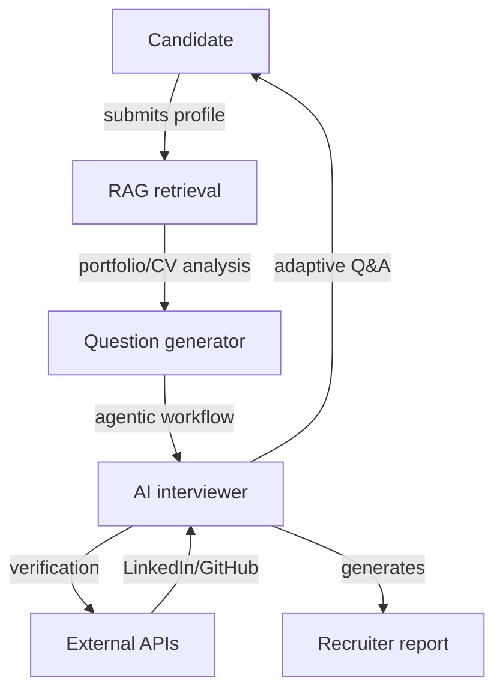

## PROBLEM → SOLUTION

Recruitment is broken. CVs are static, outdated, and easy to fabricate. Recruiters spend hours screening candidates only to discover mismatches in live interviews. We built Hireverse — an AI interviewer that conducts structured, adaptive interviews with candidates, verifies their skills in real‑time, and generates comprehensive reports for recruiters.

### System pillars

- **Agentic AI interviewer**: dynamic question generation based on candidate profile, industry context, and previous answers.
- **RAG-powered context**: vector search across candidate portfolios, case studies, and industry knowledge bases to personalize questions.
- **Real‑time verification**: cross-references candidate claims with LinkedIn, GitHub, and public portfolios.
- **Structured reports**: generates recruiter-ready summaries with skill assessments, red flags, and follow-up recommendations.

## PIPELINE IN NUMBERS

- **92%** interview completion rate (candidates finish the AI interview).
- **< 3 minutes** average time to generate personalized interview from candidate profile.
- **15+ questions** dynamically generated per interview based on role and seniority.

## FLOW OVERVIEW

### Reference kit

- **Agentic workflow** — n8n orchestration with Pinecone vector store for RAG.
- **Dynamic interviews** — questions adapt based on candidate responses and detected skill gaps.
- **Verification layer** — cross-references candidate claims with public data sources.
- **Recruiter dashboard** — structured reports with skill scores, red flags, and interview transcripts.

## WHY IT WORKS

- **Candidates engage**: conversational AI feels less intimidating than traditional screening.
- **Recruiters save time**: pre-screened candidates arrive with verified skills and detailed reports.
- **Scalable**: AI handles initial screening 24/7, allowing recruiters to focus on high-value conversations.

## NEXT ITERATIONS

1. **Multi-language support** for global recruitment.
2. **Video interview mode** with facial expression analysis and tone detection.
3. **Integration with ATS systems** (Greenhouse, Lever, Workday).

## TECHNICAL ARCHITECTURE

Built on n8n workflow automation platform with Pinecone vector database for RAG capabilities. Interview questions are generated using GPT-4 with contextual embeddings from candidate portfolios. Verification layer integrates with LinkedIn API, GitHub API, and web scraping for portfolio validation.

### Key components

- **n8n workflows**: orchestrate interview flow, RAG retrieval, question generation, and report synthesis.
- **Pinecone vector store**: stores candidate portfolio embeddings for semantic search and context matching.
- **GPT-4 inference**: generates adaptive questions based on candidate profile and previous answers.
- **TypeScript webhooks**: custom verification logic and API integrations.

## AUI — Adaptive User Interface

The interview interface adapts to candidate responses — branching questions based on detected expertise levels, adjusting difficulty dynamically, and surfacing follow-up probes when claims seem inconsistent. This creates a natural, conversational flow while maintaining rigorous assessment standards.
