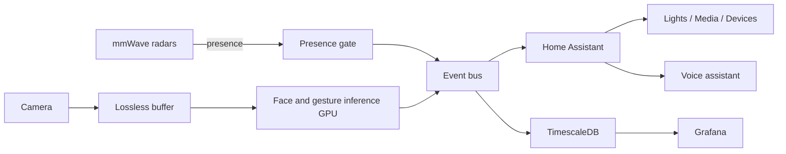

## WHAT IT IS

An ambient interface for the home. mmWave radars provide precise presence; the camera handles identity and intent (faces and a small gesture lexicon). Events flow into Home Assistant for immediate, explainable automations and voice interplay.

## HOW IT FEELS (FOR HUMANS)

- You raise an open palm near the TV — playback pauses; thumb‑up resumes.
- The door opens, mmWave reports presence; the camera sees a familiar face — the home greets you and restores your preferred scene.
- A swipe‑left near the counter moves the recipe step; a “stop” gesture triggers a short voice hint instead of blasting screens.

## SYSTEM PILLARS

- **Presence by mmWave** — reliable near‑field occupancy; no camera hacks for presence.
- **Face recognition at the edge** — fast identity hints for personalization (privacy guardrails apply).
- **Gesture lexicon** — a compact set (open palm, swipe, thumb‑up) mapped to safe, reversible actions.
- **Home Assistant automations** — deterministic rules that combine presence (mmWave), identity/gesture (CV), and time/context.
- **Voice interplay** — wake word + STT/TTS confirm risky actions and offer alternatives.
- **Privacy & safety** — events, not raw video; local processing preferred; retention and consent defaults are conservative.

## PIPELINE IN NUMBERS

- **< 300 ms** gesture→action p95 (local path, dev profile).
- **Near‑zero** frame drop with lossless buffering at X FPS per stream.
- **5+** cooperating services (buffer, inference, events, storage, observability).

## FLOW OVERVIEW

### Reference kit

- **Buffer & capture** — `services/rtsp-capture/`, `services/frame-buffer-v2/`
- **Events & storage** — `services/frame-events/`, `services/timescaledb/`
- **Observability** — `monitoring/`, `grafana/`, `prometheus.yml`
- **HA bridge** — MQTT/WebSocket integration (automations, voice)
- **Gesture processor** — customize the sample processor for a small, explainable gesture set

## WHY IT WORKS

Presence is done by the right sensor (mmWave). The camera is freed to understand identity and intent. Deterministic rules in HA combine signals safely, while voice confirms or offers alternatives. Privacy stays top‑of‑mind: events over pixels, local‑first processing, and short retention.

## NEXT ITERATIONS

1. Expand gesture set with per‑room context and voice confirmation thresholds.
2. On‑device models with NN accelerators for ultra‑low latency and privacy.
3. Feedback loop to fine‑tune false accept/reject rates per household.
