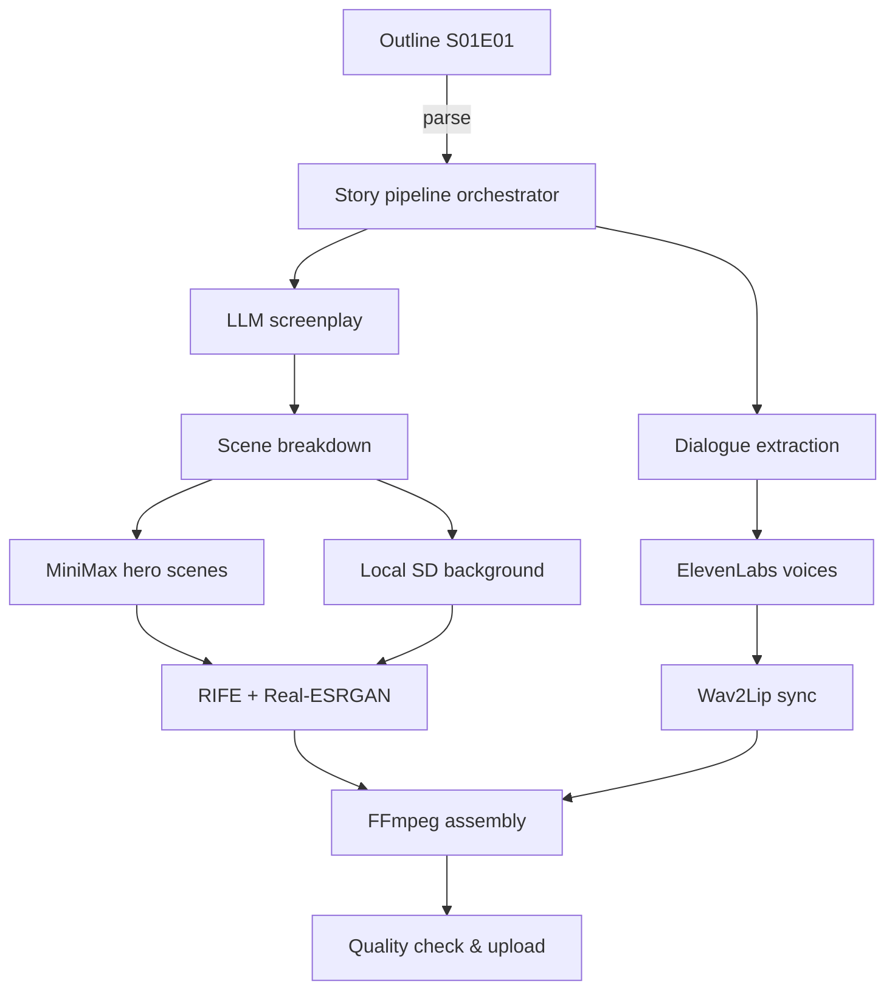

## LOOPING CITY, LIVING PIPELINE

Ouroboros City never sleeps. Every 23h 56m 4s the timeline resets, and our pipeline keeps telling the story—even while we sleep.

### System pillars

- **Story brain**: scripts generated through our story-brain orchestrator and Claude-powered screenplay generator, keeping Varick Holt, Nyx Sato, and BAR-0N consistent while iterating the “Memory Exchange” mechanic.
- **Visual engine**: hero/background allocation handled by the MiniMax automation suite, with live credit telemetry keeping MiniMax usage in check.
- **Audio & lipsync**: voices from ElevenLabs delivered by the audio fabrication pipeline, synced via our Wav2Lip nebula service.
- **Motion & polish**: RIFE + Real-ESRGAN packaged inside the GPU processing service for 60 fps / 4K upscale, all orchestrated from a single production console command.

## PIPELINE IN NUMBERS

- **21** hero clips rendered during the first MiniMax integration (tracked in the migration journal).
- **10** storyline variants evaluated by PRISM-X before locking “Memory Exchange”.
- **< $10** spend per 6-minute episode (verified by the cost telemetry dashboard).
- **7 minutes** average generation time per hero clip (hailuo-02, 60 credits) monitored by the hailuo task monitor.

## FLOW OVERVIEW

### Reference kit

- **Campaign playbook** — consolidated creative, technical, and business context.
- **MiniMax migration journal** — day-by-day log of the integration sprint (2025‑06‑24).
- **First assembled hero scene** — canonical clip combining video, audio, and lip-sync.
- **Structured episode blueprint** — machine-readable outline that drives the generator.

## WHY IT WORKS

- **Automation-first**: MCP, n8n, and scripted monitors keep the pipeline self-healing.
- **Evidence-based**: every clip, credit, and continuity decision rides through the continuity ledger.
- **Creative control**: noir tone, glitch aesthetics, and cliffhangers codified in the creative bible and style analysis dossier.

## NEXT ITERATIONS

1. **Full 5-minute pilot** using the full-episode generator plus TikTok-ready vertical exports.
2. **Audience feedback loop** wired into the live prompt manifest for voting.
3. **Monetisation ramp** — YouTube + Patreon, keeping sub-$100/ep episode cost per campaign projections.

*"Every loop has a crack. I'm just working the chisel."* — Varick Holt
