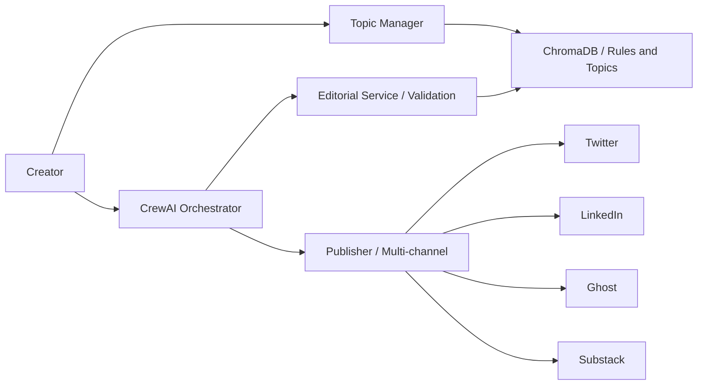

## WHAT IT IS

Vector Wave is a content fabric where rules live in a vector database, not in code. Agents don’t guess — they query the rule store for style, platform constraints, and quality checks. The result is consistent output and a pipeline that can be tuned without redeploys.

## HOW IT FEELS (FOR HUMANS)

- Write once, publish everywhere. The system turns a single idea into platform‑ready posts.
- The “editor” is built in. Tone, format, and do’s/don’ts are validated on the fly.
- One click can schedule multi‑channel publishing — with health checks and rate‑limit safety nets.
- If something wobbles, alerts and recovery kick in (no mystery failures at 2 a.m.).

## SYSTEM PILLARS

- **Rule Governance (ChromaDB‑first)**: 355+ editorial/platform rules centralized; zero hardcoded lists in agents.
- **Dual Editorial Flow**: selective (human‑assisted checkpoints) vs comprehensive (fully automated) validation.
- **CrewAI Orchestration**: research → audience → writer → style → quality with explicit checkpoints.
- **Topic Intelligence**: novelty check + idempotent suggestions; reindex/search over a vector topic store.
- **Publishing Orchestrator**: multi‑platform, rate‑limit aware, with health/metrics and automatic recovery.
- **Container‑first Ops**: services boot with health endpoints and consistent port registry.

## PIPELINE IN NUMBERS

- **355+** rules stored in ChromaDB (style, platform, scheduling, preferences).
- **<200 ms** P95 editorial validation in local dev.
- **5+** cooperating services (ChromaDB, Editorial, Topic Manager, Orchestrator, Publisher).

## FLOW OVERVIEW

### Reference kit

- **Editorial Service** — `/validate/selective` (3–4 critical rules) and `/validate/comprehensive` (8–12 rules).
- **Topic Manager** — novelty check, idempotent suggestions, vector reindex/search.
- **Orchestrator** — checkpointed flows, triage policy, health.
- **Publisher** — multi‑platform orchestration, rate‑limits, recovery, alerting.

## WHY IT WORKS

- **Governed, not guessed**: rules are searchable, versionable, and testable outside code.
- **Human‑in‑the‑loop when needed**: selective flow keeps people in control; comprehensive scales when you want speed.
- **Reliability by design**: health, rate‑limits, and recovery prevent “silent” failures.

## NEXT ITERATIONS

1. **Analytics blackbox** feeding learning loops into the editorial brain.
2. **Richer platform adapters** (thumbnails, carousels, vertical video variants).
3. **Self‑serve rule tuning** from an admin UI — no redeploys required.
