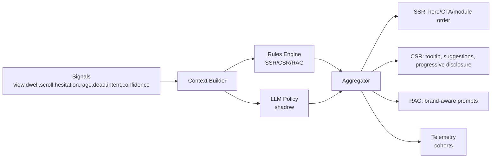

## PROBLEM → SOLUTION

Modern product pages need an assistant that actually knows the content, adapts to campaigns, and feels instant. We built a brand-aware RAG assistant with smooth streaming UX, granular telemetry, and clean integration into a single-page narrative site.

### System pillars

- **Realtime chat UX**: custom React widget with token-buffer pacing, punctuation pauses, and session/thread continuity.
- **Brand-aware context**: subdomain and route detection derive `brand_slug` and `campaign_source` to personalize prompts and analytics.
- **RAG API**: streaming endpoint with citations, thread IDs, and low-confidence signaling for graceful fallbacks.
- **Telemetry**: GTM events for open/send/done/error, plus Web Vitals and route-level cohorts for brand campaigns.

## PIPELINE IN NUMBERS

- **|types| B[Chat widget]
  B -->|streamRag| C[RAG API]
  C --> D[Retriever]
  D --> E[Vector store]
  C --> F[LLM]
  F -->|tokens| B
  C -->|citations| B
```

### Reference kit

- **Assistant widget** — minimal footprint, responsive tiers, and ESC-to-minimize.
- **RAG streaming** — tokens flushed at a natural pace with short pauses at sentence ends.
- **Campaign awareness** — brand slug + campaign source attached to every request.
- **Telemetry** — chat_open, chat_message_sent, chat_answer_done, chat_error (no PII).

## WHY IT WORKS

- **User-first**: streams feel conversational and responsive.
- **Measurable**: events land in GTM; cohorts track brand and campaign source.
- **Composable**: assistant is a drop-in widget across sections and subdomains.

## NEXT ITERATIONS

1. **Multimodal answers** with inline media cards and summaries.
2. **Playbook hooks** to deep-link into case study steps.
3. **Guardrails**: automatic fallback to generic copy on low-confidence intent.

## AUI — Adaptive User Interface

AUI in this product means the interface adapts to the user’s context and behavior — not just the device. Structural changes happen on the server (SSR) to avoid flicker; in-session micro‑adaptations happen on the client (CSR). Decisioning combines deterministic rules with a small, safe LLM policy in shadow mode.

### Signals → Decisions → UI

- Signals (consent‑gated per Consent vs Signal Matrix): `nav.view`, `dwell.time`, `nav.scroll{depth,velocity}`, `ui.hesitation`, `ui.rage_clicks`, `ui.dead_click`, plus RAG `intent` and `confidence`.
- Deterministic Rules (T14): execute across scopes (SSR/CSR/RAG) with idempotent actions and safe fallbacks.
- LLM Policy (shadow→active): interprets a PII‑safe session summary and recommends one allow‑listed action; precedence favors hard rules.

### SSR vs CSR

- SSR above‑the‑fold: hero headline/subheadline, CTA variant, module order — zero flicker.
- CSR micro‑adaptations: hesitation tooltips (>2s), low‑confidence suggested queries, progressive disclosure for Novice users.

### Privacy & performance guardrails

- Consent gating for behavioral analytics; first‑party only; no PII.
- Perf budgets: LCP ≤ 2.5s p75, CLS ≤ 0.1 p75, INP ≤ 200ms p75; telemetry and rules are lightweight.

### Example rules (initial set)

- If `intent_confidence  2s` on primary CTA → show reassurance tooltip (CSR).
- If `proficiency = Novice` → simplify above‑fold and show How‑it‑works (CSR).



## AUI in practice — signals and reactions

AUI here is not about device breakpoints or static personalization. It is a live feedback loop. The app observes a small set of consent‑gated signals and reacts with tiny, safe UI adjustments that reduce friction without harming Core Web Vitals.

### What we observe (lightweight, event‑driven)

- View and dwell: when and how long a section is actually in view (IntersectionObserver).
- Scroll depth and velocity: quick skims vs deep reads inform density and disclosure.
- Hesitation: >2s hover/focus on a primary action hints at uncertainty or missing context.
- Rage/dead clicks: frustration on non‑interactive or repeatedly clicked targets.
- RAG intent + confidence: low confidence calls for guided hand‑offs instead of guessing.

All of these are throttled and sampled; they carry no PII and respect consent from the first paint.

### How we decide (deterministic first, AI in shadow)

- Deterministic rules evaluate on SSR (structure above‑the‑fold) and CSR (micro‑adaptations). Rules are idempotent and self‑capped.
- A small LLM policy runs in shadow mode. It reads a compact session summary and recommends one allowed action. The aggregator only applies it when guardrails pass — hard rules always win.

### How the UI reacts (concrete behaviors)

- If hesitation >2s on the main CTA, show a short reassurance tooltip; hide it on interaction.
- If scroll is fast with shallow depth, compress the above‑fold (collapse extras, keep the core pitch).
- If RAG confidence is low or the user reformulates repeatedly, surface 3 guided, brand‑aware suggestions.
- If the user looks like a Novice, prefer progressive disclosure and a brief “How it works”. If a Power user, surface shortcuts.

These adjustments are tiny by design: no layout thrash, no CLS spikes, no flicker. SSR handles structure; CSR only nudges.
