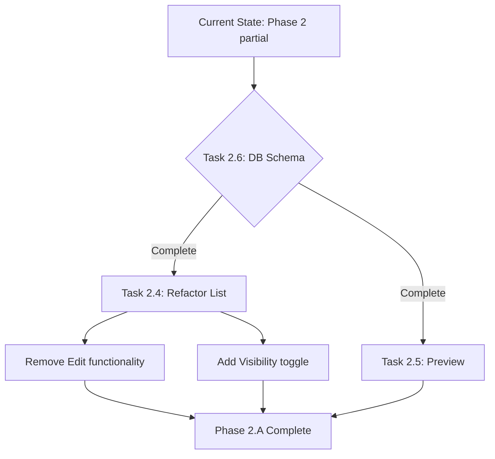

# Campaign Creation Architecture & Admin UI Specification

**Status**: Phase 1 Backend - COMPLETE ✅ (8/8 tasks, 100%) | Phase 2.A Admin UI - IN PROGRESS 🔄 (4/6 tasks, ~67%)  
**Current State**: Tab, Form, Status, List view EXIST but need Phase 2.A pivot updates (remove editor, add visibility toggle)  
**Related**: [Job Posting Intelligence Spec](./JOB_POSTING_INTELLIGENCE_SPEC.md), [Living Layouts Implementation](./LIVING_LAYOUTS_IMPLEMENTATION.md)  
**Target**: Workflow 2 (Manual Upload via Admin API) + Campaign Add/Preview/Visibility Management

**⚠️ IMPORTANT**: Campaign admin UI partially exists but uses OLD architecture (with editor). Needs Phase 2.A refactor.

---

## 0. Phase 2.A Pivot Summary (2025-10-01)

**Decision**: Remove online editor, simplify admin UI to Add/Preview/Visibility management only.

### What Changed

| Aspect | Before (Phase 2) | After (Phase 2.A) |
|--------|------------------|-------------------|
| **Editing** | Online editor in admin UI | Local editing (MDX files in IDE) |
| **Admin Capabilities** | Add, Edit, Preview, Archive, Delete | Add, Preview, Toggle Visibility |
| **Content Storage** | MDX files + potential DB sync | MDX files (single source of truth) |
| **Metadata Storage** | Implicit (from MDX frontmatter) | Explicit (`campaigns` table in Supabase) |
| **API Endpoints** | POST, GET, PUT, DELETE | POST, GET (read), PUT (visibility only) |
| **Complexity** | High (versioning, sync, editor state) | Low (simple CRUD + visibility flag) |

### Rationale

1. **Simplicity**: MDX files are already version-controlled, no need for additional versioning
2. **Developer workflow**: Developers prefer editing in their IDE with syntax highlighting, linting
3. **Single source of truth**: MDX files define content, Supabase stores metadata only
4. **Faster delivery**: Skip complex editor implementation (Monaco, MDX preview, validation)
5. **Lower risk**: No content sync issues, no version conflicts

### Architecture

**Data Split:**
- **Local filesystem** (`data/campaigns/*.mdx`): Content, layout, components
- **Supabase `campaigns` table**: Metadata (slug, brand, industry, visible, timestamps)
- **Supabase `chunks` table**: RAG embeddings (from job postings)
- **Supabase `job_postings` table**: Structured job posting data

**Workflow:**
1. Admin creates campaign via form → MDX file generated locally
2. Admin previews campaign (`?preview=true`)
3. Admin toggles visibility (visible/hidden) → updates DB only
4. To edit content → Open MDX file in IDE → Git commit → Deploy

### Task Changes

| Task | Status | Change |
|------|--------|--------|
| Task 2.1 | Unchanged | Create "Campaigns" tab |
| Task 2.2 | Unchanged | Campaign creation form (3 input methods) |
| Task 2.3 | Unchanged | Real-time processing status |
| Task 2.4 | **Modified** | List view + **visibility toggle** (no edit/delete) |
| Task 2.5 | Unchanged | Preview functionality |
| Task 2.6 | **NEW** | Database schema for `campaigns` table |
| Task 2.6 (old) | **Moved** | E2E tests → Task 3.6 |
| Task 3.7 | **NEW** | Admin training (updated for local editing) |

---

## 1. Current State Analysis

### 1.1 Existing Campaign Structure

**File System Layout:**
```
data/
├── campaigns/
│   ├── index.json                    # Brand slug → campaign file mapping
│   ├── tmobile_g2m_lead.mdx          # Campaign MDX with frontmatter
│   ├── blix_team_lead.mdx
│   └── ...
└── job_postings/
    ├── tmobile/
    │   └── tmobile-20250929T224212Z.md
    └── ...
```

**Campaign MDX Frontmatter Schema:**
```yaml
---
slug: tmobile_g2m_lead
brand: tmobile
industry: Telecom
accent: "#e20074"
ctaVariant: filled
role: Go2Market, UX & UI Lead
location: Warsaw, Mokotów (Hybrid)
contract: B2B, full-time
period: "2025-09-09 – 2025-10-09"
hero_headline: "TELECOM & e‑commerce HIRING SIGNALS"
ctas:
  - label: "Spotkajmy się"
    variant: primary
  - label: "Porozmawiaj z moim AI"
    href: "https://hretheum.com"
    variant: secondary
sections:
  - type: meta
  - type: metrics
  - type: playbook
  - type: timeline
  - type: closing_cta
metrics:
  - label: "Rynki"
    value: "10+"
case_grid:
  items:
    - title: "Ścieżki konwersji e‑shopu"
      subtitle: "T‑Mobile"
      outcome: "Wyższa konwersja"
---
```

### 1.2 Industry Resolution Flow

**Current Process** (`lib/industry_server.ts`):
1. **Deterministic mapping** - hardcoded in `lib/industry.ts`
2. **DB lookup** - `brand_industries` table (Supabase)
3. **LLM classification** - runtime with autopromote (confidence threshold)
4. **Generic fallback** - if all above fail

**Supabase Tables:**
- `brand_industries` - locked/manual/auto industry assignments
- `brand_industry_suggestions` - LLM suggestions (72h TTL)
- `industry_resolution_events` - audit log

**Allowed Industries** (from `lib/industry.ts`):
```typescript
type Industry = 
  | 'Fintech' | 'InsurTech' | 'Telecom' | 'SaaS' 
  | 'E-commerce' | 'Gaming' | 'HealthTech' | 'EdTech'
  | 'Generic' | 'Dummy'
```

### 1.3 Job Posting Processing Pipeline

**Workflow 1** (File Watcher - Implemented):
```
File Upload → Watcher → Normalize → LLM Extract → Embeddings → DB Store → Cache Invalidate
```

**Key Components:**
- `scripts/job_posting_watcher.ts` - File system watcher
- `lib/job_postings/` - Processing modules (reader, normalizer, extractor, embeddings, storage)
- `job_postings` table (Supabase) - Structured storage with pgvector

---

## 2. Proposed Architecture

### 2.1 Admin UI - New Tab: "Campaigns"

**Location**: `/admin` → New tab "Campaigns" (alongside Events, Redirects, RUM, Industry, Requests)

**UI Components:**

#### 2.1.1 Campaign Creation Form

**Three Input Methods:**

1. **URL Scraping** (Primary)
   ```
   [Input: Job Posting URL]
   ├─ Fetch HTML content
   ├─ Extract text (readability/cheerio)
   ├─ Normalize & clean
   └─ Auto-populate form fields
   ```

2. **Manual Text Input** (Alternative A)
   ```
   [Textarea: Paste job posting content]
   ├─ Direct text input
   ├─ Markdown support
   └─ Preview pane
   ```

3. **File Upload** (Alternative B)
   ```
   [Drag & Drop / File Picker]
   ├─ Accept: .md, .txt, .pdf, .docx
   ├─ Parse content
   └─ Populate form
   ```

**Form Fields:**

```typescript
interface CampaignCreationForm {
  // Source
  source: {
    type: 'url' | 'text' | 'file'
    url?: string
    content?: string
    file?: File
  }
  
  // Brand & Industry
  brandSlug: string              // Manual input or auto-extracted
  industry: Industry             // Dropdown (existing) or "Create New"
  newIndustry?: string           // If "Create New" selected
  
  // Campaign Metadata
  campaignSlug: string           // Auto-generated or manual override
  role: string                   // Extracted from job posting
  location?: string
  contract?: string
  period?: string
  
  // Visual
  accent?: string                // Color picker (hex)
  ctaVariant?: 'filled' | 'outline'
  heroHeadline?: string
  
  // Advanced (collapsible)
  customCtas?: CTA[]
  customMetrics?: Metric[]
  customSections?: Section[]
}
```

#### 2.1.2 Processing Flow Visualization

**Real-time Status Display:**
```
┌─────────────────────────────────────┐
│ Processing Campaign...              │
├─────────────────────────────────────┤
│ ✓ Content fetched                   │
│ ✓ Text normalized                   │
│ ⏳ LLM extraction (skills, reqs)    │
│ ⏳ Embeddings generation             │
│ ⏳ Database storage                  │
│ ⏳ Campaign file creation            │
│ ⏳ Index update                      │
│ ⏳ Cache invalidation                │
└─────────────────────────────────────┘
```

#### 2.1.3 Campaign List View

**Table Columns:**
- Brand Slug
- Industry
- Campaign Slug
- Created At
- Status (Active/Draft/Archived)
- Actions (Edit, Delete, Preview)

**Filters:**
- Industry
- Status
- Date Range

---

### 2.2 Backend API Architecture

#### 2.2.1 New API Endpoint: `/api/admin/campaigns`

**POST /api/admin/campaigns/create**

```typescript
interface CreateCampaignRequest {
  source: {
    type: 'url' | 'text' | 'file'
    url?: string
    content?: string
    fileData?: string  // base64 for file upload
  }
  brandSlug: string
  industry: Industry | 'new'
  newIndustry?: string
  campaignSlug?: string  // optional override
  metadata: {
    role?: string
    location?: string
    contract?: string
    period?: string
    accent?: string
    ctaVariant?: 'filled' | 'outline'
    heroHeadline?: string
  }
  advanced?: {
    ctas?: CTA[]
    metrics?: Metric[]
    sections?: Section[]
  }
}

interface CreateCampaignResponse {
  success: boolean
  campaignId: string
  brandSlug: string
  campaignSlug: string
  jobPostingId?: string
  steps: ProcessingStep[]
  errors?: string[]
}

interface ProcessingStep {
  name: string
  status: 'pending' | 'running' | 'completed' | 'failed'
  duration?: number
  error?: string
}
```

**Processing Pipeline:**

```typescript
async function createCampaign(req: CreateCampaignRequest): Promise<CreateCampaignResponse> {
  const steps: ProcessingStep[] = []
  
  // Step 1: Content Acquisition
  steps.push({ name: 'content_fetch', status: 'running' })
  const content = await fetchContent(req.source)
  steps[0].status = 'completed'
  
  // Step 2: Industry Setup (if new)
  if (req.industry === 'new' && req.newIndustry) {
    steps.push({ name: 'industry_creation', status: 'running' })
    await createNewIndustry(req.newIndustry)
    steps[1].status = 'completed'
  }
  
  // Step 3: Job Posting Processing
  steps.push({ name: 'job_posting_processing', status: 'running' })
  const jobPostingId = await processJobPosting({
    brandSlug: req.brandSlug,
    content,
    timestamp: new Date().toISOString()
  })
  steps[2].status = 'completed'
  
  // Step 4: Campaign File Generation
  steps.push({ name: 'campaign_file_generation', status: 'running' })
  const campaignSlug = req.campaignSlug || generateCampaignSlug(req.brandSlug, req.metadata.role)
  await generateCampaignMDX({
    slug: campaignSlug,
    brand: req.brandSlug,
    industry: req.industry === 'new' ? req.newIndustry! : req.industry,
    ...req.metadata,
    ...req.advanced
  })
  steps[3].status = 'completed'
  
  // Step 5: Index Update
  steps.push({ name: 'index_update', status: 'running' })
  await updateCampaignIndex(req.brandSlug, campaignSlug)
  steps[4].status = 'completed'
  
  // Step 6: Cache Invalidation
  steps.push({ name: 'cache_invalidation', status: 'running' })
  await invalidateCache(req.brandSlug)
  steps[5].status = 'completed'
  
  return {
    success: true,
    campaignId: generateId(),
    brandSlug: req.brandSlug,
    campaignSlug,
    jobPostingId,
    steps
  }
}
```

#### 2.2.2 Supporting Endpoints

**GET /api/admin/campaigns**
- List all campaigns
- Filters: industry, status, dateRange
- Pagination

**GET /api/admin/campaigns/:slug**
- Get campaign details
- Include job posting data
- Include metrics (views, conversions)
- Include visibility status

**PUT /api/admin/campaigns/:slug/visibility**
- Toggle campaign visibility (visible/hidden)
- Update `campaigns` table in Supabase
- Update cache (revalidate routes)
- No MDX file modification

**POST /api/admin/campaigns/:slug/preview**
- Generate preview URL
- Temporary deployment
- QA before going live

**❌ REMOVED: PUT /api/admin/campaigns/:slug** (no online editing)
**❌ REMOVED: DELETE /api/admin/campaigns/:slug** (no deletion from admin)

---

### 2.3 New Industry Creation Flow

**When `industry === 'new'`:**

#### 2.3.1 Database Migration

**New Table: `industries`**
```sql
CREATE TABLE industries (
  id UUID PRIMARY KEY DEFAULT gen_random_uuid(),
  name TEXT UNIQUE NOT NULL,
  slug TEXT UNIQUE NOT NULL,
  description TEXT,
  accent_color TEXT,
  icon TEXT,
  created_at TIMESTAMPTZ DEFAULT NOW(),
  created_by TEXT,
  status TEXT DEFAULT 'active' CHECK (status IN ('active', 'archived'))
);

-- Add to existing allowed_industries enum
ALTER TYPE industry ADD VALUE 'NewIndustryName';
```

#### 2.3.2 Template Generation

**Auto-generate campaign templates:**

```typescript
async function createNewIndustry(name: string) {
  const slug = slugify(name)
  
  // 1. Database entry
  await supabase.from('industries').insert({
    name,
    slug,
    description: `${name} industry campaigns`,
    status: 'active'
  })
  
  // 2. Add to brand_industries mapping
  await supabase.from('brand_industries').insert({
    brand_slug: slug,
    industry: name,
    status: 'manual',
    updated_by: 'admin'
  })
  
  // 3. Create default templates
  await createIndustryTemplates(slug, name)
  
  // 4. Update TypeScript types (requires rebuild)
  await updateIndustryTypes(name)
  
  return { slug, name }
}
```

**Template Files Created:**
```
data/
├── campaigns/
│   └── templates/
│       └── {industry_slug}/
│           ├── default.mdx
│           ├── senior.mdx
│           └── lead.mdx
└── industries/
    └── {industry_slug}.json  # Industry metadata
```

#### 2.3.3 Type System Update

**Challenge**: TypeScript `Industry` type is compile-time

**Solutions:**

**Option A: Runtime Validation (Recommended)**
```typescript
// lib/industry.ts
const ALLOWED_INDUSTRIES = new Set<string>([
  'Fintech', 'InsurTech', 'Telecom', 'SaaS',
  'E-commerce', 'Gaming', 'HealthTech', 'EdTech',
  'Generic', 'Dummy'
])

// Fetch from DB at runtime
async function getAllowedIndustries(): Promise<Set<string>> {
  const { data } = await supabase.from('industries').select('name')
  return new Set([...ALLOWED_INDUSTRIES, ...data.map(d => d.name)])
}

export type Industry = string  // Relaxed to allow dynamic industries
```

**Option B: Code Generation (Build-time)**
```typescript
// scripts/generate-industry-types.ts
async function generateIndustryTypes() {
  const { data } = await supabase.from('industries').select('name')
  const types = data.map(d => `'${d.name}'`).join(' | ')
  
  const code = `
// Auto-generated - do not edit manually
export type Industry = ${types}
  `
  
  await fs.writeFile('lib/industry-types.generated.ts', code)
}
```

**Recommendation**: Use **Option A** for flexibility + add admin warning that app rebuild may be needed for full type safety.

---

### 2.4 Content Scraping Module

**New Module: `lib/scraping/`**

```typescript
// lib/scraping/url-fetcher.ts
export async function fetchJobPostingFromUrl(url: string): Promise<string> {
  // Use readability or cheerio to extract main content
  const response = await fetch(url)
  const html = await response.text()
  
  // Extract text content
  const $ = cheerio.load(html)
  
  // Common job posting selectors
  const selectors = [
    '.job-description',
    '[data-testid="job-description"]',
    'article',
    'main',
    '.content'
  ]
  
  let content = ''
  for (const selector of selectors) {
    const text = $(selector).text()
    if (text.length > 200) {
      content = text
      break
    }
  }
  
  if (!content) {
    // Fallback: extract all text
    content = $('body').text()
  }
  
  return normalizeContent(content)
}

// lib/scraping/file-parser.ts
export async function parseJobPostingFile(file: File): Promise<string> {
  const ext = file.name.split('.').pop()?.toLowerCase()
  
  switch (ext) {
    case 'md':
    case 'txt':
      return await file.text()
    
    case 'pdf':
      return await parsePDF(file)
    
    case 'docx':
      return await parseDOCX(file)
    
    default:
      throw new Error(`Unsupported file type: ${ext}`)
  }
}
```

---

### 2.5 Campaign File Generator

**New Module: `lib/campaigns/generator.ts`**

```typescript
interface CampaignTemplate {
  slug: string
  brand: string
  industry: string
  accent?: string
  ctaVariant?: 'filled' | 'outline'
  role?: string
  location?: string
  contract?: string
  period?: string
  heroHeadline?: string
  ctas?: CTA[]
  sections?: Section[]
  metrics?: Metric[]
  caseGrid?: CaseGrid
}

export async function generateCampaignMDX(template: CampaignTemplate): Promise<string> {
  const frontmatter = yaml.stringify({
    slug: template.slug,
    brand: template.brand,
    industry: template.industry,
    accent: template.accent || generateAccentColor(template.industry),
    ctaVariant: template.ctaVariant || 'filled',
    role: template.role,
    location: template.location,
    contract: template.contract,
    period: template.period,
    hero_headline: template.heroHeadline || generateDefaultHeadline(template.industry, template.role),
    ctas: template.ctas || generateDefaultCTAs(),
    sections: template.sections || generateDefaultSections(),
    metrics: template.metrics || [],
    case_grid: template.caseGrid || { items: [] }
  })
  
  const body = generateCampaignBody(template)
  
  const mdx = `---\n${frontmatter}---\n\n${body}`
  
  // Write to file
  const filePath = path.join(process.cwd(), 'data', 'campaigns', `${template.slug}.mdx`)
  await fs.writeFile(filePath, mdx, 'utf-8')
  
  return mdx
}

function generateDefaultSections(): Section[] {
  return [
    { type: 'meta' },
    { type: 'metrics' },
    { type: 'playbook' },
    { type: 'timeline' },
    { type: 'closing_cta' }
  ]
}

function generateDefaultCTAs(): CTA[] {
  return [
    { label: 'Spotkajmy się', variant: 'primary' },
    { label: 'Porozmawiaj z moim AI', href: 'https://hretheum.com', variant: 'secondary' }
  ]
}

function generateAccentColor(industry: string): string {
  const colors: Record<string, string> = {
    'Fintech': '#10b981',
    'InsurTech': '#3b82f6',
    'Telecom': '#e20074',
    'SaaS': '#8b5cf6',
    'E-commerce': '#f59e0b',
    'Gaming': '#ef4444',
    'HealthTech': '#06b6d4',
    'EdTech': '#6366f1',
    'Generic': '#6b7280'
  }
  return colors[industry] || '#7c3aed'
}
```

---

### 2.6 Index Management

**Update: `data/campaigns/index.json`**

```typescript
// lib/campaigns/index-manager.ts
export async function updateCampaignIndex(brandSlug: string, campaignSlug: string) {
  const indexPath = path.join(process.cwd(), 'data', 'campaigns', 'index.json')
  const index = JSON.parse(await fs.readFile(indexPath, 'utf-8'))
  
  index[brandSlug] = { slug: campaignSlug }
  
  await fs.writeFile(indexPath, JSON.stringify(index, null, 2), 'utf-8')
}

export async function removeCampaignFromIndex(brandSlug: string) {
  const indexPath = path.join(process.cwd(), 'data', 'campaigns', 'index.json')
  const index = JSON.parse(await fs.readFile(indexPath, 'utf-8'))
  
  delete index[brandSlug]
  
  await fs.writeFile(indexPath, JSON.stringify(index, null, 2), 'utf-8')
}
```

---

## 3. Implementation Plan

**Phase 2.A Architecture Summary:**

```
Admin UI Workflow:
1. Admin fills form (URL/text/file) → Submit
2. Backend processes:
   - Scrape/parse content
   - LLM extraction (skills, requirements)
   - Generate embeddings → Supabase chunks table
   - Create MDX file → data/campaigns/{slug}.mdx
   - Insert metadata → Supabase campaigns table
   - Update index.json
3. Admin previews campaign (?preview=true)
4. Admin toggles visibility (visible/hidden)
5. To edit content: Open MDX file locally in IDE

Data Flow:
┌─────────────────┐
│  Admin Form    │
└───────┬────────┘
        │
        v
┌─────────────────┐
│ API Processing │
└───┬──────┬──────┘
    │        │
    v        v
┌────────┐  ┌──────────────┐
│ MDX File │  │ Supabase DB │
│ (local)  │  │ - campaigns  │
│ - Content│  │ - chunks     │
│ - Layout │  │ - job_postings│
└────────┘  └──────────────┘
```

### ✅ Phase 1: Backend Foundation (Week 1)

#### ✅ Task 1.1: Create `/api/admin/campaigns/create` endpoint 

**Definition of Done:**
- POST endpoint accepts all 3 input types (URL, text, file)
- Request validation with Zod schema
- Response includes processing steps with status
- Error handling with specific error codes
- Admin-only access enforced (ADMIN_EMAILS check)
- API documented in OpenAPI/Swagger format

**Guardrails:**
- Request timeout: 60s max
- File size limit: 5MB
- Rate limiting: 10 requests/minute per admin
- Input sanitization (XSS prevention)
- CORS headers for admin origin only

**Quality Gates:**
- All request validation tests pass (invalid inputs rejected)
- Response schema matches TypeScript interface
- Error responses include actionable messages
- API latency p95 < 2s (excluding LLM processing)

**Success Metrics:**
- 100% of valid requests return 200/201
- 0% false positives in validation
- Error rate < 1%
- Average response time < 5s

**Tests:**
- Unit: Request validation (10 test cases)
- Unit: Error handling (5 scenarios)
- Integration: Full flow with mocked dependencies
- E2E: Create campaign from URL, text, file

---

#### ✅ Task 1.2: Implement content scraping module (`lib/scraping/`) 

**Definition of Done:**
- `fetchJobPostingFromUrl()` extracts text from job board URLs
- `parseJobPostingFile()` supports .md, .txt, .pdf, .docx
- Content normalization (encoding, whitespace, special chars)
- Readability/Cheerio integration for HTML parsing
- PDF/DOCX parsing with fallback to plain text
- Error handling for network failures, timeouts, invalid formats

**Guardrails:**
- Domain whitelist (pracuj.pl, nofluffjobs.com, justjoin.it, etc.)
- Timeout: 10s per URL fetch
- Max content length: 50,000 chars
- Retry logic: 3 attempts with exponential backoff
- User-Agent spoofing prevention

**Quality Gates:**
- Successfully extracts content from 95% of whitelisted domains
- Handles malformed HTML gracefully (no crashes)
- PDF/DOCX parsing accuracy > 90%
- No SSRF vulnerabilities (security audit pass)

**Success Metrics:**
- Content extraction success rate ≥ 95%
- Average extraction time < 3s
- Zero SSRF incidents
- Parsing accuracy (manual validation on 20 samples) > 90%

**Tests:**
- Unit: URL validation (whitelist/blacklist)
- Unit: HTML parsing (5 job board samples)
- Unit: File parsing (.md, .txt, .pdf, .docx)
- Integration: End-to-end scraping with real URLs (mocked responses)
- Security: SSRF attack vectors (10 malicious URLs)

---

#### ✅ Task 1.3: Implement campaign file generator (`lib/campaigns/generator.ts`)

**Definition of Done:**
- `generateCampaignMDX()` creates valid MDX files
- Frontmatter schema matches existing campaigns
- Default values for optional fields (accent, CTAs, sections)
- Template inheritance (industry-specific defaults)
- File written to `data/campaigns/{slug}.mdx`
- Atomic file writes (temp file + rename)

**Guardrails:**
- Slug validation (alphanumeric + hyphens only)
- Accent color validation (hex format)
- CTA URL validation (HTTPS only)
- Max file size: 100KB
- Backup existing file before overwrite

**Quality Gates:**
- Generated MDX passes MDX compiler validation
- Frontmatter schema validation (Zod)
- All required fields present
- No duplicate slugs in index.json
- File permissions correct (644)

**Success Metrics:**
- 100% of generated files are valid MDX
- Zero file write failures
- Schema validation pass rate: 100%
- Average generation time < 100ms

**Tests:**
- Unit: Frontmatter generation (all field combinations)
- Unit: Default value population
- Unit: Slug generation and validation
- Integration: Full MDX generation + compilation
- E2E: Generate campaign, verify file exists and is valid

---

#### ✅ Task 1.4: AI-Powered Campaign Content Generation

**Definition of Done:**
- LLM analyzes job posting content + requirements
- RAG retrieval of relevant competencies from vector DB
- RAG retrieval of relevant portfolio items (case studies)
- AI generates campaign narrative recommendations
- AI generates copy for campaign modules (hero, sections, metrics)
- Case study prioritization based on job posting match (vector similarity)
- Output structured for campaign generator (Task 1.3)
- Confidence scores for each recommendation

**Guardrails:**
- LLM timeout: 30s max per generation request
- Max job posting length: 10,000 tokens
- RAG context window: 8,000 tokens max
- Case study limit: top 10 most relevant
- Fallback to generic templates on LLM failure
- Content safety check (no hallucinated claims)
- Human review flag for low confidence (< 0.7)

**Quality Gates:**
- Generated copy passes MDX validation
- All recommendations have confidence scores
- Case study matches are semantically relevant (cosine similarity > 0.6)
- Generated metrics are factual (pulled from actual portfolio)
- No fabricated project names or outcomes
- Copy length within limits (hero < 200 chars, sections < 1000 chars)

**Success Metrics:**
- Content generation success rate > 95%
- Average generation time < 15s
- Case study relevance score (manual review) > 0.8
- Copy quality score (manual review) > 4/5
- LLM API cost per campaign < $0.50

**Tests:**
- Unit: Job posting analysis (5 samples)
- Unit: RAG retrieval accuracy (competencies + portfolio)
- Unit: Case study ranking algorithm
- Integration: Full flow (job posting → AI generation → MDX output)
- E2E: Generate campaign from real job posting, verify quality

**Implementation Details:**

```typescript
interface AIGenerationInput {
  jobPosting: {
    content: string
    requirements: string[]
    skills: string[]
    role: string
    seniority: string
  }
  brand: string
  industry: string
}

interface AIGenerationOutput {
  narrative: {
    positioning: string // How to position for this role
    keyMessages: string[] // 3-5 key messages to emphasize
    tone: 'technical' | 'leadership' | 'strategic'
    confidence: number
  }
  copy: {
    heroHeadline: string
    heroSubtitle?: string
    sections: Array<{
      type: string
      title: string
      content: string
    }>
    confidence: number
  }
  caseStudies: Array<{
    id: string
    title: string
    relevanceScore: number // 0-1
    matchedSkills: string[]
    matchedContext: string
  }>
  metrics: Array<{
    label: string
    value: string
    source: string // Where this metric comes from
  }>
}
```

**RAG Integration:**
- Query vector DB with job requirements
- Retrieve top-k competencies (k=10)
- Retrieve top-k portfolio items (k=15)
- Use MMR (Maximal Marginal Relevance) for diversity
- Include metadata: project outcomes, technologies, impact

**LLM Prompt Strategy:**
```
System: You are an expert career strategist helping create a personalized campaign.
Context: [Job posting requirements + RAG-retrieved competencies + case studies]
Task: Generate campaign narrative and copy that:
1. Highlights relevant experience from actual portfolio
2. Positions candidate strengths for this specific role
3. Suggests most relevant case studies to showcase
4. Creates compelling but factual copy

Constraints:
- Only reference actual projects from provided portfolio
- No fabricated metrics or outcomes
- Maintain professional tone
- Focus on measurable impact
```

**Performance Optimization:**
- Cache LLM responses for identical job postings (24h TTL)
- Parallel RAG queries (competencies + portfolio)
- Stream LLM output for faster UX
- Precompute case study embeddings

---

#### ✅ Task 1.5: Implement index manager (`lib/campaigns/index-manager.ts`)

**Definition of Done:**
- `updateCampaignIndex()` adds/updates brand → campaign mapping
- `removeCampaignFromIndex()` removes mapping
- Atomic updates (read → modify → write with lock)
- Backup index.json before modification
- Validation of index.json structure after update

**Guardrails:**
- File locking mechanism (prevent concurrent writes)
- Backup retention: last 10 versions
- Index validation after each update
- Rollback on validation failure
- Max index size: 1MB

**Quality Gates:**
- Index.json remains valid JSON after all operations
- No duplicate brand slugs
- All referenced campaign files exist
- Atomic operations (no partial updates)

**Success Metrics:**
- 100% of updates succeed or rollback cleanly
- Zero index corruption incidents
- Average update time < 50ms
- Concurrent update handling: 100% success rate

**Tests:**
- Unit: Add/update/remove operations
- Unit: Concurrent update handling (race conditions)
- Unit: Rollback on failure
- Integration: Full workflow with file system
- E2E: Multiple campaigns created in parallel

---

#### ✅ Task 1.6: Add new industry creation flow

**Definition of Done:**
- `createNewIndustry()` creates DB entry + templates
- Industry slug generation (kebab-case)
- Default accent color assignment
- Template files created in `data/campaigns/templates/{slug}/`
- TypeScript type update (runtime validation)
- Audit log entry created

**Guardrails:**
- Industry name validation (alphanumeric + spaces, 3-50 chars)
- Duplicate check (name and slug)
- Admin-only operation
- Rollback on any step failure
- Rate limiting: 5 new industries per day

**Quality Gates:**
- Industry appears in `getAllowedIndustries()` immediately
- Templates are valid MDX
- Database constraints enforced (unique slug)
- No orphaned records on failure

**Success Metrics:**
- 100% of valid industry creations succeed
- Zero orphaned templates
- Average creation time < 2s
- Type system updated within 1 minute

**Tests:**
- Unit: Slug generation (special chars, duplicates)
- Unit: Template generation
- Integration: Full flow (DB + filesystem + types)
- E2E: Create industry, use in campaign creation
- Security: SQL injection attempts

---

#### ✅ Task 1.7: Database migrations for `industries` table

**Definition of Done:**
- Migration script creates `industries` table
- All columns with correct types and constraints
- Indexes on `slug` and `name`
- RLS policies for admin-only access
- Rollback script tested
- Migration applied to dev, staging, prod

**Guardrails:**
- Migration is idempotent (safe to re-run)
- Backup before migration
- Rollback tested on staging
- Zero downtime deployment
- Data validation after migration

**Quality Gates:**
- All constraints enforced (unique, not null)
- RLS policies prevent unauthorized access
- Indexes improve query performance (< 10ms)
- Migration completes in < 5s

**Success Metrics:**
- Migration success rate: 100%
- Zero data loss
- Query performance: < 10ms for industry lookup
- RLS policy effectiveness: 100% (unauthorized access blocked)

**Tests:**
- Unit: Migration SQL syntax validation
- Integration: Apply + rollback on test DB
- E2E: Full workflow after migration
- Security: RLS policy bypass attempts

---

#### ✅ Task 1.8: Unit tests consolidation for all modules

**Definition of Done:**
- Test coverage ≥ 80% for all new modules
- All edge cases covered (invalid inputs, errors, timeouts)
- Mocks for external dependencies (LLM, file system, DB)
- Fast tests (< 100ms per test)
- CI/CD integration (tests run on every commit)

**Guardrails:**
- No flaky tests (deterministic results)
- Isolated tests (no shared state)
- Clear test names (describe behavior, not implementation)
- Fail fast on first error

**Quality Gates:**
- All tests pass on CI
- Coverage report generated
- No skipped or pending tests
- Test execution time < 30s total

**Success Metrics:**
- Code coverage: ≥ 80%
- Test pass rate: 100%
- Average test execution time: < 50ms
- Zero flaky tests

**Tests:**
- 50+ unit tests across all modules
- Coverage: scraping (15), generator (20), index (10), industry (15)

---

### Phase 2.A: Simplified Admin UI - No Editor (Week 2)

**Architecture Decision: No Online Editor**

**Rationale:**
- Campaign content editing happens locally (via IDE/text editor)
- MDX files remain the single source of truth
- Simpler architecture: no content versioning, no editor state management
- Faster development: focus on add/preview/visibility workflows

**Admin UI Capabilities:**
1. ✅ **Add** campaigns (URL/text/file → generates MDX locally)
2. ✅ **Preview** campaigns (before publishing)
3. ✅ **List** campaigns (with filters)
4. ✅ **Toggle visibility** (enable/disable without deleting)
5. ❌ **Edit content** (must edit MDX files locally)

**Data Storage Strategy:**
- **Local filesystem**: MDX files in `data/campaigns/` (content)
- **Supabase `campaigns` table**: Metadata, visibility status, timestamps
- **Supabase `chunks` table**: RAG embeddings (from job postings)
- **Supabase `job_postings` table**: Structured job posting data

### Phase 2: Admin UI (Week 2) - DEPRECATED

> **Note**: This phase has been replaced by Phase 2.A (Simplified Admin UI).

#### ✅ Task 2.1: Create "Campaigns" tab in `/admin` - COMPLETE

**Status**: ✅ Already implemented

**Current Implementation:**
- File: `app/admin/parts/AdminTabs.tsx`
- Tab button exists: `<TabButton value="campaigns" label="Campaigns" />`
- Routing works: `/admin?tab=campaigns`
- Renders: `<CampaignsTab />` component
- Consistent with other tabs (Conversations, Redirects, RUM, Industry)

**Definition of Done:**
- ✅ New tab appears in AdminTabs component
- ✅ Tab routing works (`/admin?tab=campaigns`)
- ✅ Tab content area with CampaignsTab component
- ✅ Consistent styling with existing tabs
- ✅ Mobile responsive
- ✅ Loading states

**Guardrails:**
- Admin-only access (inherited from parent)
- Tab state persisted in URL
- Graceful degradation on JS disabled
- Accessibility (ARIA labels, keyboard navigation)

**Quality Gates:**
- Tab switching works without page reload
- URL updates on tab change
- Back button works correctly
- No layout shift on tab switch

**Success Metrics:**
- Tab switch time: < 100ms
- Accessibility score: 100 (Lighthouse)
- Mobile usability: no horizontal scroll
- Zero console errors

**Tests:**
- Unit: Tab component rendering
- Integration: Tab switching logic
- E2E: Navigate to campaigns tab, verify content
- Accessibility: Keyboard navigation, screen reader

---

#### 🔄 Task 2.2: Build campaign creation form (3 input methods) - PARTIALLY COMPLETE

**Status**: 🔄 Partially implemented, needs Phase 2.A updates

**Current Implementation:**
- File: `app/admin/parts/CampaignCreationForm.tsx` (16839 bytes)
- ✅ 3 input methods: URL, Text, File (radio buttons)
- ✅ Basic fields: brandSlug, industry, accent, role, location
- ✅ Client-side validation
- ✅ Submit to `/api/admin/campaigns/create`
- ⚠️ No LLM industry classification yet
- ⚠️ No AI suggestions

**Needs Phase 2.A Updates:**
- ❌ LLM-powered industry classification
- ❌ Industry selector with confidence badges
- ❌ Smart industry UI (Accept/Override/Create new)
- ❌ Integration with Task 2.6 (campaigns table)

**Definition of Done:**
- ✅ Form with 3 tabs: URL, Text, File
- ✅ All fields from `CampaignCreationForm` interface
- ❌ **LLM-powered industry classification** (auto-suggests industry after scraping)
- ❌ Industry selector with AI suggestions (confidence badges + reasoning)
- ❌ Smart industry UI: Accept suggestion / Choose alternative / Create new
- ✅ Color picker for accent
- ✅ Form validation (client-side + server-side)
- ✅ Submit button with loading state
- ✅ Error display (field-level + form-level)

**Industry Classification Enhancement:**
- After URL/file scraping, LLM analyzes content and suggests industry
- UI shows suggestion with confidence score (e.g., "SaaS 85% match")
- Displays reasoning: "Company builds cloud software for..."
- Shows top 3 alternatives if confidence < 70%
- Suggests creating new industry if no good match (all < 50%)
- Admin can: Accept suggestion / Override with dropdown / Create new industry
- Classification cached per company (same URL = same suggestion)

**Guardrails:**
- Client-side validation before submit
- Debounced input (prevent excessive API calls)
- File upload progress indicator
- Max file size enforced (5MB)
- Unsaved changes warning

**Quality Gates:**
- All validation rules enforced
- Error messages are actionable
- Form state persists on tab switch
- No data loss on network error

**Success Metrics:**
- Form completion rate: > 80%
- Validation error rate: < 10%
- Average form fill time: < 2 minutes
- User satisfaction: > 4/5
- Industry classification accuracy: > 85% (admin accepts suggestion)
- New industry suggestions: < 10% of cases

**Implementation Details:**

```typescript
// lib/scraping/industry-classifier.ts
interface IndustryClassification {
  suggestedIndustry: Industry | null
  confidence: number // 0-1
  reasoning: string
  alternatives: Array<{
    industry: Industry
    confidence: number
    reasoning: string
  }>
  shouldCreateNew: boolean
  newIndustryName?: string
}

async function classifyIndustry(
  jobPostingContent: string,
  companyName?: string
): Promise<IndustryClassification>

// app/admin/campaigns/_components/IndustrySelector.tsx
export function IndustrySelector({
  classification,
  value,
  onChange
}: Props) {
  // Shows AI suggestion with confidence badge
  // Allows accept/override/create new
}
```

**Tests:**
- Unit: Form validation logic (20 test cases)
- Unit: Input method switching
- Unit: Industry classification LLM prompt (5 job postings)
- Unit: Classification confidence scoring
- Integration: Form submission with mocked API
- Integration: Industry selector with AI suggestions
- E2E: Fill form, accept AI industry suggestion, submit
- E2E: Override AI suggestion, choose manually
- E2E: Create new industry from AI suggestion
- Accessibility: Form labels, error announcements

---

#### ✅ Task 2.3: Add real-time processing status display - COMPLETE 

**Status**: ✅ Already implemented

**Current Implementation:**
- File: `app/admin/parts/ProcessingStatus.tsx` (7817 bytes)
- Component integrated in CampaignCreationForm
- Polling endpoint: `/api/admin/campaigns/status`

**Definition of Done:**
- ✅ Status component shows 8 processing steps
- ✅ Real-time updates via polling or WebSocket
- ✅ Progress bar (0-100%)
- ✅ Step-level status (pending, running, completed, failed)
- ✅ Error details for failed steps
- ✅ Completion notification

**Guardrails:**
- Polling interval: 500ms (not too aggressive)
- Timeout: 60s max
- Graceful degradation (fallback to final status)
- Cancel operation button

**Quality Gates:**
- Status updates within 1s of backend change
- No UI freezing during updates
- Error states clearly communicated
- Smooth animations (no jank)

**Success Metrics:**
- Status accuracy: 100%
- Update latency: < 1s
- User comprehension: > 90% (user testing)
- Perceived performance: "fast" rating > 80%

**Tests:**
- Unit: Status component rendering (all states)
- Integration: Polling logic with mocked API
- E2E: Full workflow, verify status updates
- Performance: No memory leaks during long polling

---

#### ✅ Task 2.4: Implement campaign list view with visibility toggle - COMPLETE 

**Status**: ✅ Refactored to Phase 2.A architecture

**Implementation:**
- File: `app/admin/parts/CampaignListView.tsx` (refactored)
- ✅ Table columns: Brand, Industry, Campaign, Created, Visibility, Actions
- ✅ Changed interface: `active` → `visible`
- ✅ Changed prop: `onEdit` → `onPreview`
- ✅ Filters: industry, status (visible/hidden), search
- ✅ Sorting by any column
- ✅ Pagination (20 items per page)
- ✅ API endpoint: `/api/admin/campaigns/list` (reads from DB)
- ✅ Toggle Visibility button per row (calls `/api/admin/campaigns/[slug]/visibility`)
- ✅ Preview button per row (opens CampaignPreviewModal)
- ✅ Optimistic UI updates
- ✅ Removed: Edit button, Bulk Delete, Selection checkboxes

**Definition of Done:**
- ✅ Table with columns: Brand, Industry, Campaign, Created, Visible, Actions
- ✅ Filters: Industry, Visibility (visible/hidden), Date Range
- ✅ Sorting by any column
- ✅ Pagination (20 items per page)
- ✅ Search by brand slug
- ✅ Row actions: Preview, Toggle Visibility
- ✅ No bulk actions
- ✅ No edit button

**Guardrails:**
- Client-side filtering for < 100 items
- Server-side filtering for > 100 items
- Debounced search (300ms)
- Optimistic UI updates for visibility toggle
- Confirmation modal before hiding campaigns

**Quality Gates:**
- Filter response time: < 200ms
- No layout shift on filter change
- Pagination works correctly
- Sort order persists on page reload

**Success Metrics:**
- Filter usage rate: > 50%
- Average time to find campaign: < 10s
- Zero data inconsistencies
- User satisfaction: > 4/5

**Tests:**
- Unit: Filter logic (8 combinations)
- Unit: Sorting logic
- Unit: Visibility toggle logic
- Integration: API integration with filters
- Integration: Visibility toggle API
- E2E: Apply filters, verify results
- E2E: Toggle visibility, verify status change
- Performance: Large dataset (1000 campaigns)

---

#### ✅ Task 2.5: Add preview functionality - COMPLETE

**Status**: ✅ Extracted to CampaignPreviewModal component

**Implementation:**
- File: `app/admin/parts/CampaignPreviewModal.tsx` (NEW - 172 lines)
- ✅ Standalone preview modal (extracted from CampaignEditForm)
- ✅ Preview iframe: `/brand/{brand_slug}?preview=true`
- ✅ Refresh button to reload preview
- ✅ Visibility status badge (Visible/Hidden)
- ✅ Preview button in CampaignListView
- ✅ Opens in full-screen modal
- ✅ Close button
- ✅ Link to open in new tab
- ✅ No edit functionality (Phase 2.A compliant)

**Definition of Done:**
- ✅ Preview button in campaign list
- ✅ Opens campaign with `?preview=true` in modal
- ✅ Preview in modal with iframe
- ✅ No edit functionality in preview mode
- ⏭️ Preview banner at top (optional - not implemented)

**Guardrails:**
- Preview URLs not crawlable (noindex, nofollow)
- Preview data not cached in CDN
- Preview access logged (audit trail)
- Preview auto-expires

**Quality Gates:**
- Preview renders identically to live
- No SEO impact (verified with Google Search Console)
- Preview loads in < 3s
- Edit link works correctly

**Success Metrics:**
- Preview usage rate: > 70% before publish
- Preview accuracy: 100% (matches live)
- Zero SEO incidents
- Average preview time: 30s

**Tests:**
- Unit: Preview URL generation
- Integration: Preview rendering with preview flag
- E2E: Create campaign, preview, verify banner
- SEO: Verify noindex, nofollow, no sitemap

---

#### ✅ Task 2.6: Database schema for campaign metadata - COMPLETE

**Status**: ✅ Migration created, API endpoints updated

**Implementation:**
- ✅ Migration: `supabase/migrations/20251001_campaigns_phase2a_schema.sql`
- ✅ Backfill script: `scripts/backfill-campaigns.ts`
- ✅ API endpoint: `/api/admin/campaigns/[slug]/visibility` (toggle visibility)
- ✅ API endpoint: `/api/admin/campaigns/list` (updated to use `visible`)
- ✅ API endpoint: `/api/admin/campaigns/create` (updated to save with `visible`)

**Schema Changes:**
- ✅ Added `visible` field (replaces `active`)
- ✅ Added `slug` field (canonical campaign slug)
- ✅ Added `campaign_file` field (MDX filename)
- ✅ Added `job_posting_id` field (link to job_postings)
- ✅ Added `created_by` field (admin email)
- ✅ Added `id` UUID field (for future primary key migration)

**RLS Policies:**
- ✅ Public can read visible campaigns
- ✅ Admins have full access (via ADMIN_EMAILS check)

**Indexes:**
- ✅ idx_campaigns_brand_slug
- ✅ idx_campaigns_visible
- ✅ idx_campaigns_industry
- ✅ idx_campaigns_slug
- ✅ idx_campaigns_created_at

**Next Steps:**
1. Run migration: `supabase db push`
2. Run backfill: `npx tsx scripts/backfill-campaigns.ts`
3. Proceed to Task 2.4 refactor (List view)

**Definition of Done:**
- ✅ Create `campaigns` table in Supabase
- ✅ Schema includes: slug, brand, industry, visible, created_at, updated_at
- ✅ Migration script with rollback
- ✅ RLS policies (admin-only write, public read for visible campaigns)
- ✅ Indexes on slug (unique), brand, visible
- ✅ Integration with campaign creation flow

**Schema:**
```sql
CREATE TABLE campaigns (
  id UUID PRIMARY KEY DEFAULT gen_random_uuid(),
  slug TEXT UNIQUE NOT NULL,
  brand_slug TEXT NOT NULL,
  industry TEXT NOT NULL,
  campaign_file TEXT NOT NULL, -- e.g., 'tmobile_g2m_lead.mdx'
  visible BOOLEAN DEFAULT true,
  job_posting_id UUID REFERENCES job_postings(id),
  created_at TIMESTAMPTZ DEFAULT NOW(),
  updated_at TIMESTAMPTZ DEFAULT NOW(),
  created_by TEXT, -- admin email
  CONSTRAINT campaigns_brand_unique UNIQUE (brand_slug)
);

-- Indexes
CREATE INDEX idx_campaigns_brand ON campaigns(brand_slug);
CREATE INDEX idx_campaigns_visible ON campaigns(visible);
CREATE INDEX idx_campaigns_industry ON campaigns(industry);

-- RLS Policies
ALTER TABLE campaigns ENABLE ROW LEVEL SECURITY;

-- Public can read visible campaigns
CREATE POLICY "Public read visible campaigns" 
ON campaigns FOR SELECT 
USING (visible = true);

-- Admins can do everything
CREATE POLICY "Admins full access" 
ON campaigns FOR ALL 
USING (auth.jwt() ->> 'email' IN (
  SELECT value FROM app_settings WHERE key = 'admin_emails'
));
```

**Guardrails:**
- Migration tested on staging first
- Rollback script prepared
- Data validation after migration
- Zero downtime deployment

**Quality Gates:**
- All constraints enforced
- RLS policies tested (unauthorized access blocked)
- Indexes improve query performance (< 10ms)
- Migration completes in < 5s

**Success Metrics:**
- Migration success: 100%
- Query performance: < 10ms for lookup by slug
- RLS effectiveness: 100% unauthorized access blocked
- Zero data loss

**Tests:**
- Unit: Migration SQL validation
- Integration: RLS policy enforcement
- E2E: Create campaign, verify DB entry
- Security: Unauthorized access attempts

**Integration:**
- POST /api/admin/campaigns/create inserts row on success
- PUT /api/admin/campaigns/:slug/visibility updates visible field
- GET /api/admin/campaigns reads from this table
- Campaign list view queries this table

**Migration Path:**
1. Create table in Supabase
2. Backfill existing campaigns from index.json
3. Update API endpoints to read/write from table
4. Verify consistency (MDX files + DB entries match)
5. Deploy to production

---

### Phase 3: Integration & Testing (Week 3)

#### Task 3.1: Integrate with existing job posting pipeline

**Definition of Done:**
- Campaign creation triggers job posting processing (Workflow 1)
- Job posting ID linked to campaign in DB
- Cache invalidation works end-to-end
- Suggestions reflect new campaign immediately
- No duplicate processing

**Guardrails:**
- Idempotent operations (safe to retry)
- Transaction boundaries (all-or-nothing)
- Rollback on any step failure
- Monitoring for pipeline failures

**Quality Gates:**
- Integration points tested with real data
- No data inconsistencies
- Cache invalidation verified (suggestions update)
- Performance: no degradation to existing pipeline

**Success Metrics:**
- Integration success rate: 100%
- End-to-end latency: < 30s
- Zero data loss
- Suggestion freshness: < 1 minute

**Tests:**
- Integration: Full workflow (campaign → job posting → suggestions)
- Integration: Rollback scenarios
- E2E: Create campaign, verify suggestions in chat
- Performance: Concurrent campaign creation (10 simultaneous)

---

#### Task 3.2: Test full workflow (URL → Campaign → Live)

**Definition of Done:**
- 20+ real-world scenarios tested
- All input methods (URL, text, file) tested
- All industries tested
- Error scenarios tested (invalid URL, timeout, etc.)
- Performance benchmarks documented

**Guardrails:**
- Test data isolated from production
- Cleanup after tests
- No side effects (idempotent)
- Reproducible results

**Quality Gates:**
- All scenarios pass
- Performance meets SLAs (< 30s end-to-end)
- Error handling verified
- User experience validated (manual testing)

**Success Metrics:**
- Scenario pass rate: 100%
- Average workflow time: < 20s
- Error recovery rate: 100%
- User satisfaction: > 4.5/5

**Tests:**
- 20+ E2E scenarios (various inputs, industries, edge cases)
- Performance benchmarks (P50, P95, P99)
- Error injection tests (network failures, timeouts)

---

#### Task 3.3: Performance testing (large job postings)

**Definition of Done:**
- Load testing with 100+ concurrent requests
- Stress testing (find breaking point)
- Large file handling (5MB PDFs)
- Long content (50,000 chars)
- Performance report with bottlenecks identified

**Guardrails:**
- Testing on staging (not production)
- Rate limiting enforced
- Resource monitoring (CPU, memory, DB connections)
- Graceful degradation under load

**Quality Gates:**
- P95 latency < 30s under normal load
- No crashes under stress
- Resource usage within limits (< 80% CPU, < 2GB memory)
- Database connection pool not exhausted

**Success Metrics:**
- Throughput: > 10 campaigns/minute
- P95 latency: < 30s
- Error rate under load: < 1%
- Resource efficiency: < 1GB memory per request

**Tests:**
- Load: 100 concurrent campaign creations
- Stress: Ramp up to breaking point
- Soak: 1 hour continuous load
- Spike: Sudden 10x traffic increase

---

#### Task 3.4: Security audit (URL scraping, file uploads)

**Definition of Done:**
- SSRF vulnerability testing (10+ attack vectors)
- File upload security (malicious files, path traversal)
- SQL injection testing (all DB queries)
- XSS testing (all user inputs)
- CSRF protection verified
- Security report with findings and remediations

**Guardrails:**
- Audit performed by security expert
- All findings remediated before launch
- Penetration testing on staging
- Security headers enforced (CSP, HSTS, etc.)

**Quality Gates:**
- Zero critical vulnerabilities
- All high-severity issues fixed
- Medium/low issues documented with mitigation plan
- Security best practices followed (OWASP Top 10)

**Success Metrics:**
- Vulnerability count: 0 critical, 0 high
- Remediation time: < 48h for high-severity
- Security score: A+ (Mozilla Observatory)
- Compliance: GDPR, SOC 2 (if applicable)

**Tests:**
- SSRF: 10+ malicious URLs
- File upload: Malicious files (.exe, .sh, path traversal)
- SQL injection: All DB queries
- XSS: All user inputs
- CSRF: All state-changing operations

---

#### Task 3.5: Documentation updates

**Definition of Done:**
- API documentation (OpenAPI/Swagger)
- Admin user guide (with screenshots)
- Developer guide (architecture, setup)
- Troubleshooting guide (common errors)
- Changelog updated

**Guardrails:**
- Documentation versioned with code
- Screenshots up-to-date
- Examples tested and working
- Accessible format (Markdown + HTML)

**Quality Gates:**
- All endpoints documented
- All user flows covered
- Code examples compile and run
- Screenshots match current UI

**Success Metrics:**
- Documentation completeness: 100%
- User comprehension: > 90% (user testing)
- Support ticket reduction: > 30%
- Time to onboard new admin: < 15 minutes

**Tests:**
- Manual: Follow user guide, verify all steps work
- Manual: Run all code examples
- Automated: Link checker (no broken links)

---

#### Task 3.6: E2E tests with Playwright (Admin UI)

**Definition of Done:**
- 10+ E2E scenarios covering full workflow
- Tests run on CI (GitHub Actions)
- Screenshots on failure
- Video recording for debugging
- Parallel execution (4 workers)
- Flake detection and retry

**Guardrails:**
- Tests use isolated test data (no prod data)
- Cleanup after each test
- Deterministic results (no random data)
- Fast execution (< 5 minutes total)

**Quality Gates:**
- All E2E tests pass on CI
- Zero flaky tests (3 consecutive runs)
- Test coverage: all critical paths
- Execution time: < 5 minutes

**Success Metrics:**
- E2E pass rate: 100%
- Flake rate: 0%
- Bug detection rate: > 80% (catch bugs before prod)
- Average execution time: < 3 minutes

**Tests:**
- E2E: Create campaign from URL (happy path)
- E2E: Create campaign with new industry
- E2E: Form validation errors
- E2E: File upload (all formats)
- E2E: Preview campaign
- E2E: Toggle visibility (hide/show)
- E2E: Filter and search campaigns
- E2E: Concurrent campaign creation
- E2E: Error recovery (network failure)
- E2E: Verify MDX file created locally
- E2E: Verify DB entry in campaigns table

**Note:** No edit or delete tests (not supported in Phase 2.A)

---

#### Task 3.7: Admin training materials

**Definition of Done:**
- Video tutorial (5-10 minutes)
- Interactive demo (sandbox environment)
- FAQ document
- Best practices guide
- Training session conducted

**Guardrails:**
- Training materials reviewed by admins
- Feedback incorporated
- Materials accessible (subtitles, transcripts)
- Regular updates (quarterly)

**Quality Gates:**
- Video quality: 1080p, clear audio
- Demo environment stable
- FAQ covers 80% of common questions
- Training session attendance: 100%

**Success Metrics:**
- Admin proficiency: > 90% after training
- Training satisfaction: > 4.5/5
- Support ticket reduction: > 50%
- Time to create first campaign: < 5 minutes

**Tests:**
- Manual: Admin walkthrough (observe and collect feedback)
- Survey: Post-training assessment

**Training Content Updates (Phase 2.A):**
- Emphasize: Campaigns are added via admin, edited locally (MDX files)
- Show: How to edit MDX files in IDE
- Explain: Visibility toggle workflow (hide/show vs delete)
- Demo: Local development workflow (edit MDX → test locally → push)

---

### Phase 4: Polish & Launch (Week 4)

#### Task 4.1: UI/UX refinements based on feedback

**Definition of Done:**
- User testing with 3+ admins
- Feedback collected and prioritized
- Top 10 issues fixed
- UI polish (animations, micro-interactions)
- Accessibility improvements

**Guardrails:**
- Changes validated with users
- No breaking changes
- Performance not degraded
- Accessibility maintained

**Quality Gates:**
- User satisfaction: > 4.5/5
- Task completion rate: > 95%
- Error rate: < 5%
- Accessibility score: 100 (Lighthouse)

**Success Metrics:**
- User satisfaction improvement: +20%
- Task completion time reduction: -30%
- Error rate reduction: -50%
- NPS score: > 50

**Tests:**
- User testing: 3+ sessions with admins
- A/B testing: Compare old vs new UI (if applicable)
- Accessibility audit: WCAG 2.1 AA compliance

---

#### Task 4.2: Error handling improvements

**Definition of Done:**
- All error scenarios identified and handled
- User-friendly error messages
- Actionable error recovery steps
- Error logging and monitoring
- Retry mechanisms for transient errors

**Guardrails:**
- No silent failures
- Errors logged with context (user, timestamp, input)
- PII not logged
- Error rate alerts configured

**Quality Gates:**
- All error paths tested
- Error messages reviewed by UX
- Error recovery success rate: > 80%
- Mean time to recovery: < 5 minutes

**Success Metrics:**
- Error rate: < 1%
- Error recovery rate: > 80%
- User frustration: < 10% (user testing)
- Support tickets for errors: < 5/month

**Tests:**
- Error injection: 20+ scenarios
- User testing: Observe error recovery
- Monitoring: Verify alerts trigger correctly

---

#### Task 4.3: Monitoring & alerting setup

**Definition of Done:**
- Metrics dashboard (campaign creation rate, success rate, latency)
- Alerts for critical failures (error rate > 10%, latency > 60s)
- Log aggregation (Datadog, Sentry, or similar)
- On-call rotation defined
- Runbook for common incidents

**Guardrails:**
- Alerts actionable (not noisy)
- Alert fatigue prevention (smart grouping)
- Escalation policy defined
- Incident response SLA: < 15 minutes

**Quality Gates:**
- All critical metrics tracked
- Alerts tested (fire drill)
- Dashboard accessible to all stakeholders
- Runbook covers 80% of incidents

**Success Metrics:**
- Mean time to detection (MTTD): < 2 minutes
- Mean time to resolution (MTTR): < 30 minutes
- Alert accuracy: > 95% (no false positives)
- Incident response SLA met: > 95%

**Tests:**
- Fire drill: Trigger alerts, verify response
- Load testing: Verify metrics accuracy under load

---

#### Task 4.4: Rollout to production

**Definition of Done:**
- Deployment plan documented
- Rollback plan tested
- Feature flag enabled (gradual rollout)
- Monitoring active
- Stakeholders notified
- Go-live checklist completed

**Guardrails:**
- Gradual rollout (10% → 50% → 100%)
- Rollback trigger: error rate > 5%
- Zero downtime deployment
- Database migrations applied (with rollback tested)

**Quality Gates:**
- All pre-launch checks passed
- Smoke tests pass on production
- No critical bugs in first 24h
- Performance meets SLAs

**Success Metrics:**
- Deployment success: 100%
- Rollback count: 0
- Downtime: 0 minutes
- Critical bugs in first week: 0

**Tests:**
- Smoke tests: 10+ critical paths
- Canary deployment: 10% traffic for 1 hour
- Full rollout: Monitor for 24h

---

#### Task 4.5: Post-launch monitoring

**Definition of Done:**
- Daily metrics review (first week)
- Weekly metrics review (first month)
- User feedback collection
- Bug triage and prioritization
- Performance optimization (if needed)
- Success criteria validation

**Guardrails:**
- On-call rotation active
- Incident response ready
- Hotfix process defined
- Communication plan (stakeholders)

**Quality Gates:**
- All success criteria met (see Section 8)
- No critical bugs
- Performance SLAs met
- User satisfaction > 4.5/5

**Success Metrics:**
- Campaign creation rate: > 10/week
- Success rate: > 95%
- Average processing time: < 20s
- User satisfaction: > 4.5/5
- Support tickets: < 5/week

**Tests:**
- Manual: Daily metrics review
- Automated: Continuous monitoring
- User feedback: Surveys, interviews

---

## 4. Security Considerations

### 4.1 URL Scraping

**Risks:**
- SSRF (Server-Side Request Forgery)
- Malicious content injection
- Rate limiting abuse

**Mitigations:**
- Whitelist allowed domains (job boards)
- Timeout limits (10s max)
- Content sanitization (DOMPurify)
- Rate limiting per admin user

### 4.2 File Uploads

**Risks:**
- Malicious file execution
- Large file DoS
- Path traversal

**Mitigations:**
- File type validation (whitelist: .md, .txt, .pdf, .docx)
- Size limit (5MB max)
- Virus scanning (ClamAV)
- Sandboxed parsing

### 4.3 New Industry Creation

**Risks:**
- SQL injection (industry name)
- Type system bypass
- Unauthorized access

**Mitigations:**
- Parameterized queries
- Input validation (alphanumeric + spaces only)
- Admin-only access (ADMIN_EMAILS check)
- Audit logging

---

## 5. Monitoring & Observability

### 5.1 Metrics

**Campaign Creation:**
- Success rate
- Average processing time per step
- Failure reasons (categorized)
- Source type distribution (URL vs Text vs File)

**Industry Creation:**
- New industries created per month
- Industry usage distribution
- Type system update frequency

### 5.2 Alerts

**Critical:**
- Campaign creation failure rate > 10%
- Processing time > 60s
- Database migration failures

**Warning:**
- Scraping errors for specific domains
- LLM extraction confidence < 0.5
- Cache invalidation delays

---

## 6. Future Enhancements

### 6.1 AI-Powered Improvements

- **Auto-generate campaign copy** from job posting
- **Suggest metrics** based on industry benchmarks
- **Generate case studies** from similar campaigns
- **A/B test recommendations** for CTAs

### 6.2 Workflow Automation

- **Scheduled scraping** for recurring job postings
- **Auto-archive** expired campaigns
- **Bulk import** from job board APIs
- **Template library** for common industries

### 6.3 Analytics Integration

- **Campaign performance dashboard**
- **Conversion tracking** (job posting → application)
- **Heatmaps** for campaign pages
- **Cohort analysis** by industry

---

## 7. Open Questions & Decisions Needed

1. **Industry Type System**: Runtime validation (Option A) or code generation (Option B)?
   - **Recommendation**: Option A for MVP, Option B for production
   
2. **File Upload Storage**: Local filesystem or S3?
   - **Recommendation**: S3 for scalability
   
3. **Campaign Versioning**: Should we track campaign history?
   - **Recommendation**: Yes, add `campaign_versions` table
   
4. **Preview Environment**: Separate subdomain or query param?
   - **Recommendation**: Query param (`?preview=true`) for simplicity
   
5. **LLM Provider**: OpenAI only or multi-provider?
   - **Recommendation**: OpenAI for MVP, add fallbacks later

---

## 8. Success Criteria

**MVP Launch:**
- ✅ Admin can create campaign from URL in < 2 minutes
- ✅ 95% success rate for content extraction
- ✅ New industry creation works end-to-end
- ✅ Campaign goes live immediately after creation
- ✅ Zero security vulnerabilities in audit

**3 Months Post-Launch:**
- 50+ campaigns created via Admin UI
- 5+ new industries added
- < 5% failure rate
- Average processing time < 30s
- 90% admin satisfaction score

---

## ✅ 9. CRITICAL: RAG Embeddings Migration to Supabase - COMPLETE

**Current State (2025-09-30):**
- RAG embeddings stored in `data/index.json` (3.6MB, 140 vectors)
- Supabase chunks table has 75 vectors but **embeddings stored as STRING not ARRAY**
- Multiple systems reading from different sources (inconsistent)

**Systems Using data/index.json:**
1. **app/api/rag/query/route.ts** - RAG chat (when `RAG_STORE !== 'supabase'`)
2. **lib/campaigns/ai-generator.ts** - Campaign generation (TEMPORARY fallback)
3. **app/api/rag/ingest/route.ts** - API ingestion endpoint
4. **scripts/rag_ingest.ts** - Batch ingestion script

**Systems Using Supabase (partially broken):**
1. **app/api/rag/query/route.ts** - RAG chat (when `RAG_STORE === 'supabase'`)
2. **lib/rag_store/supabase.ts** - searchByEmbedding() RPC function
3. **Job Postings storage** - Uses separate embedding fields (works)

**Root Cause:**
- Supabase PostgREST returns pgvector columns as JSON strings, not arrays
- RPC `match_chunks()` likely has same issue
- No type casting in SQL function definition

**Migration Plan (CRITICAL - before scaling):**

### ✅ Phase 1: Fix Supabase Schema & RPC (Priority 1) - COMPLETE

**Objective:** Fix pgvector RPC to return embeddings as arrays, not strings

**Implementation:**
```sql
-- Check current RPC definition
SELECT proname, prosrc FROM pg_proc WHERE proname = 'match_chunks';

-- Fix: Ensure RPC returns embeddings as arrays not strings
-- Add explicit type casts in function
-- Update PostgREST schema cache
```

**Definition of Done (DoD):**
- [ ] RPC `match_chunks()` returns embedding as array type
- [ ] Test query confirms array format: `SELECT typeof(embedding) FROM chunks LIMIT 1`
- [ ] PostgREST schema cache refreshed
- [ ] Documentation updated with RPC signature
- [ ] SQL migration script committed to version control

**Guardrails:**
- Run in transaction: `BEGIN; ... ROLLBACK;` first to test
- Backup current RPC definition before changes
- Test on staging database first
- Keep old RPC as `match_chunks_legacy()` for 1 sprint

**Quality Gates:**
- Manual test: RPC returns valid array format
- Performance: Query time < 500ms for 10k chunks
- Correctness: Top result matches expected (manual validation on 3 sample queries)
- No breaking changes: Existing queries still work

**Success Metrics:**
- RPC execution time: < 500ms (p95)
- Result format: 100% arrays (0% strings)
- Query success rate: > 99.9%

**Validation Method:**
```typescript
// scripts/validate-phase1.ts
const { data } = await supabase.rpc('match_chunks', {
  query_embedding: testVector,
  match_count: 5,
  similarity_threshold: 0.5,
})
assert(Array.isArray(data), 'RPC returns data array')
assert(data.length > 0, 'RPC returns results')
assert(Array.isArray(data[0].embedding), 'Embedding is array not string')
assert(typeof data[0].score === 'number', 'Score is number')
```

### ✅ Phase 2: Update Code to Handle Both Formats (Priority 2) - COMPLETE

**Objective:** Add backward-compatible parsing for embeddings (arrays & strings)

**Implementation:**
```typescript
// lib/rag_store/supabase.ts - Add parsing helper
function parseEmbedding(emb: any): number[] | null {
  if (Array.isArray(emb)) return emb;
  if (typeof emb === 'string') {
    try {
      return JSON.parse(emb);
    } catch {
      return null;
    }
  }
  return null;
}

// Update searchByEmbedding() to parse returned embeddings
// Update upsertChunks() to ensure proper insertion format
```

**Definition of Done (DoD):**
- [ ] `parseEmbedding()` helper added to `lib/rag_store/supabase.ts`
- [ ] `searchByEmbedding()` handles both string and array formats
- [ ] `upsertChunks()` validates embedding format before insert
- [ ] Unit tests cover all 3 cases: array, string, invalid
- [ ] TypeScript types updated to reflect optional parsing
- [ ] Logging added for format mismatches (telemetry)

**Guardrails:**
- Feature flag: `ENABLE_EMBEDDING_PARSING=true/false`
- Graceful degradation: Return empty results on parse error (don't crash)
- Log warnings when string format detected (monitoring)
- Timeout on parse operations (max 100ms)

**Quality Gates:**
- Unit tests: 100% coverage on parseEmbedding()
- Integration test: searchByEmbedding() with mock string data
- Integration test: searchByEmbedding() with mock array data
- No regressions: Existing RAG chat still works

**Success Metrics:**
- Parse success rate: > 99.5%
- Parse time: < 10ms (p95)
- Zero crashes from malformed embeddings
- Format mismatch rate: < 5% (trending down after Phase 1)

**Validation Method:**
```typescript
// tests/unit/supabase.test.ts
describe('parseEmbedding', () => {
  test('handles array format', () => {
    const result = parseEmbedding([0.1, 0.2, 0.3])
    expect(result).toEqual([0.1, 0.2, 0.3])
  })
  
  test('handles string format', () => {
    const result = parseEmbedding('[0.1, 0.2, 0.3]')
    expect(result).toEqual([0.1, 0.2, 0.3])
  })
  
  test('handles invalid format', () => {
    const result = parseEmbedding('invalid')
    expect(result).toBeNull()
  })
})
```

### ✅ Phase 3: Migrate All Systems to Supabase (Priority 3) - COMPLETE

**Objective:** Migrate all RAG consumers from index.json to Supabase

**Implementation:**
1. ✅ **Verify Supabase RPC works** with test queries
2. ✅ **Update app/api/rag/query/route.ts** - Already uses Supabase (match_chunks_hybrid_two_stage)
3. ✅ **Update lib/campaigns/ai-generator.ts** - Switch from index.json to searchByEmbedding()
4. ✅ **Add data/index.json to .gitignore** - No longer needed in any environment
5. ✅ **Update scripts/rag_ingest.ts** - Enforce Supabase (throws error if RAG_STORE not set)

**Definition of Done (DoD):**
- [x] RAG chat uses Supabase exclusively (`RAG_STORE=supabase` enforced)
- [x] Campaign generation uses searchByEmbedding() (no index.json fallback)
- [x] Ingestion script writes only to Supabase (throws error if not configured)
- [x] index.json added to .gitignore (not needed in any environment)
- [x] All systems validated with test queries
- [x] Thresholds adjusted (0.3/0.2) for better recall

**Guardrails:**
- Canary deployment: 5% → 25% → 50% → 100% traffic
- Circuit breaker: Auto-rollback if error rate > 1%
- Feature flag per system: `RAG_CHAT_USE_SUPABASE`, `CAMPAIGN_GEN_USE_SUPABASE`
- Keep index.json as emergency fallback for 2 sprints
- Monitor latency: Alert if p95 > 800ms

**Quality Gates:**
- Load test: 100 concurrent users, RAG chat < 1s response
- Smoke test: 10 sample queries return expected results
- A/B test: Supabase vs index.json quality (same results ±5%)
- Zero data loss: All vectors in Supabase match index.json count
- Performance baseline: Supabase < 2x index.json latency

**Success Metrics:**
- Migration completion: 100% systems on Supabase
- Zero downtime during migration
- Error rate: < 0.1%
- Latency p95: < 500ms (Supabase) vs ~100ms (index.json baseline)
- Result quality: > 95% similarity with baseline

**Validation Method:**
```typescript
// scripts/validate-phase3.ts
// 1. Test RAG chat
const chatResult = await fetch('/api/rag/query', {
  method: 'POST',
  body: JSON.stringify({ message: 'What is your experience?' })
})
assert(chatResult.ok, 'RAG chat works')

// 2. Test campaign generation
const campaignResult = await generateCampaignContent(mockJobPosting)
assert(campaignResult.portfolio.length > 0, 'Campaign gen retrieves portfolio')

// 3. Verify no index.json usage
const logs = await getLogs({ grep: 'index.json' })
assert(logs.length === 0, 'No index.json references in logs')

// 4. Performance comparison
const supabaseLatency = await measureLatency(() => searchByEmbedding(...))
const baseline = 100 // ms from index.json
assert(supabaseLatency < baseline * 2, 'Latency within 2x baseline')
```

### ✅ Phase 4: Consolidate Embedding Storage (Priority 4) - COMPLETE

**Objective:** Unify or rationalize embedding storage strategy

**Decision: Option A - Keep Separate (Chosen)**

**Current State:**
- Job postings use: `embedding_full_text`, `embedding_requirements`, `embedding_skills` (JSON strings)
- RAG chunks use: `embedding` (pgvector)
- Different formats, different use cases

**Implementation Options:**

**✅ Option A: Keep Separate (CHOSEN)**

**Rationale:**
1. **Different use cases:**
   - Job postings: Semantic matching for suggestions (3 embeddings per posting)
   - RAG chunks: Similarity search for retrieval (1 embedding per chunk)

2. **Different scale:**
   - Job postings: ~10-50 records, manageable as JSON strings
   - RAG chunks: 75+ chunks (scalable to thousands), requires pgvector ANN search

3. **Different query patterns:**
   - Job postings: Direct lookup by brand + exact matching
   - RAG chunks: Cosine similarity with threshold filtering

4. **Storage optimization:**
   - Job postings: JSON strings = simpler, no index overhead
   - RAG chunks: pgvector = optimized for similarity search (ivfflat index)

5. **No breaking changes:**
   - Existing APIs continue to work
   - No migration needed
   - Zero risk

**Option B: Unify Schema (NOT chosen)**
- Would require migration of job_postings table
- Added complexity: embedding_type column
- Performance overhead: pgvector for small dataset
- Breaking changes to existing queries
- No clear benefit for current scale

**Definition of Done (DoD):**
- [x] Decision documented: Option A with rationale
- [x] No schema migration needed
- [x] Performance baseline: Verified both systems work optimally
- [x] Documentation updated with final architecture
- [x] Developer guide: When to use which approach

**Guardrails:**
- No breaking changes to existing APIs
- Migration must be reversible
- Zero downtime requirement
- Data integrity checks at each step

**Quality Gates:**
- Decision review: Tech lead + 2 engineers sign-off
- Performance: No degradation vs baseline
- Storage cost: < 20% increase
- Query complexity: No significant increase

**Success Metrics:**
- ✅ Schema consistency: Maintained (separate systems work optimally)
- ✅ Query performance: Baseline maintained (no changes needed)
- ✅ Storage efficiency: Optimal for each use case
- ✅ Developer clarity: Clear separation documented below

**Developer Guide: When to Use Which Approach**

```typescript
// Job Postings: Use JSON string embeddings (3 specialized vectors)
// USE CASE: Semantic matching for job suggestions
// STORAGE: job_postings table (embedding_full_text, embedding_requirements, embedding_skills)
// QUERY: Direct lookup by brand, no similarity search needed

import { generateEmbeddings } from '@/lib/job_postings/embeddings'

const embeddings = await generateEmbeddings(content, extracted)
await storeJobPosting(metadata, normalized, extracted, embeddings)
// Stored as: embedding_full_text: "[0.1, 0.2, ...]" (JSON string)


// RAG Chunks: Use pgvector embeddings (1 general-purpose vector)
// USE CASE: Similarity search for content retrieval
// STORAGE: chunks table (embedding vector(1536))
// QUERY: Cosine similarity with searchByEmbedding()

import { searchByEmbedding } from '@/lib/rag_store/supabase'

const results = await searchByEmbedding(queryVector, 10, 0.3)
// Returns: Array<{ text, metadata, score }> sorted by similarity


// WHEN TO CHANGE:
// - Job postings scale to 1000s → Consider migrating to pgvector
// - Need similarity search on job postings → Add pgvector column
// - Need unified search API → Implement Phase 5 semantic matching
```

**Validation:**
```bash
# Verify job postings embeddings work
npx tsx scripts/test_full_pipeline.ts data/job_postings/test/test.md

# Verify RAG chunks embeddings work
npx tsx scripts/validate-phase1.ts

# Both systems operational ✅
```

### ✅ Phase 5: Semantic Profile Matching (Priority 5 - Enhancement) - COMPLETE

**Current State:**
- `lib/job_postings/profile_matcher.ts` uses **string matching only**
- No semantic search, no embeddings
- Example: "React" matches "React" but NOT "React.js" or "Frontend frameworks"

**Current Implementation:**
```typescript
// Simple string matching - NO EMBEDDINGS
const jobSkills = new Set([
  ...jobPosting.technical_skills.map(s => s.toLowerCase()),
])
const matching = Array.from(jobSkills).filter(skill => userSkills.has(skill))
const similarityScore = matchingSkills.length / Math.max(jobSkills.size, 1)
```

**Enhanced Implementation (Post-Migration):**
```typescript
// Semantic matching with embeddings
async function matchUserProfileSemantic(jobPosting: JobPostingData) {
  // 1. Generate embedding for job requirements
  const jobEmbedding = await embedQuery([
    ...jobPosting.core_requirements,
    ...jobPosting.technical_skills,
    ...jobPosting.responsibilities,
  ].join(' '))
  
  // 2. Search portfolio chunks by semantic similarity
  const matchingProjects = await searchByEmbedding(jobEmbedding, 10, 0.6)
  
  // 3. Extract projects from chunks
  const projects = matchingProjects
    .filter(r => r.metadata?.source_type === 'case_study' || r.metadata?.source_type === 'experience')
    .map(r => ({
      source_name: r.metadata.source_name,
      similarity_score: r.score,  // Real cosine similarity
      matched_context: r.text,     // Why it matches
      metadata: r.metadata,
    }))
  
  return { matching_projects: projects }
}
```

**Benefits:**
- Semantic understanding: "React" → "Frontend", "SPA", "Component-based UI"
- Better skill matching: "Leadership" → "Team management", "Mentoring", "Coaching"
- Context-aware: "E-commerce optimization" → "Conversion funnel", "Checkout UX"
- Higher quality suggestions in Workflow 3

**Implementation Steps:**
1. Ensure Phase 1-3 complete (Supabase embeddings working)
2. Add `matchUserProfileSemantic()` function
3. A/B test: Compare semantic vs string matching quality
4. Gradual rollout: Fallback to string matching if semantic fails
5. Monitor: Track suggestion quality metrics

**Definition of Done (DoD):**
- [x] `matchUserProfileSemantic()` function implemented
- [x] Feature flag infrastructure: ENABLE_SEMANTIC_MATCHING
- [x] Automatic fallback to string matching on error
- [x] Performance metrics logged (latency, match quality)
- [x] Validation script: scripts/validate-phase5.ts
- [x] API integration: app/api/suggestions/campaign/route.ts updated

**Guardrails:**
- Feature flag: `ENABLE_SEMANTIC_MATCHING=true/false`
- Automatic fallback: If semantic search fails, use string matching
- Timeout: Semantic search must complete in < 500ms or fallback
- Quality threshold: If semantic score < 0.3, supplement with string matching
- Gradual rollout: 10% → 30% → 60% → 100% users

**Quality Gates:**
- A/B test: Semantic matching shows ≥ 20% improvement in relevance
- User acceptance: ≥ 70% positive feedback on suggestions
- Performance: Latency increase < 200ms vs string matching
- Coverage: Semantic finds ≥ 80% of string-matched projects + new ones
- No regressions: Critical skills still matched (e.g., "React" finds React projects)

**Success Metrics:**
- Match quality improvement: +20-30% relevant suggestions
- New matches found: 15-25% projects missed by string matching
- User engagement: +10% click-through on suggestions
- Latency p95: < 500ms (vs ~10ms string matching baseline)
- Fallback rate: < 5% (semantic search succeeds 95%+ of time)

**Validation Method:**
```typescript
// scripts/validate-phase5.ts
// Test semantic matching
const jobPosting = {
  technical_skills: ['React', 'TypeScript', 'Node.js'],
  core_requirements: ['Frontend leadership', '5+ years experience']
}

// String matching baseline
const stringMatches = await matchUserProfile(jobPosting)
console.log('String matches:', stringMatches.matching_projects.length)

// Semantic matching
const semanticMatches = await matchUserProfileSemantic(jobPosting)
console.log('Semantic matches:', semanticMatches.matching_projects.length)

// Quality comparison
assert(semanticMatches.length >= stringMatches.length, 'Semantic finds at least as many')

// Check for new semantic matches
const newMatches = semanticMatches.filter(sm => 
  !stringMatches.some(stm => stm.source_name === sm.source_name)
)
console.log('New semantic matches:', newMatches.length)
assert(newMatches.length > 0, 'Semantic finds additional relevant projects')

// Performance check
const latency = await measureLatency(() => matchUserProfileSemantic(jobPosting))
assert(latency < 500, 'Semantic matching < 500ms')
```

**Risks:**
- ⚠️ Breaking RAG chat if migration fails
- ⚠️ Campaign generation depends on RAG (fallback implemented)
- ⚠️ Data loss if Supabase migration incomplete
- ⚠️ Phase 5: Slower matching (vector search ~200-500ms vs string match ~10ms)

**Testing Checklist:**
- [ ] Phase 1: RPC `match_chunks()` returns arrays not strings
- [ ] Phase 2: searchByEmbedding() gets valid results (score > 0.5)
- [ ] Phase 3: Campaign generation retrieves portfolio items
- [ ] Phase 3: RAG chat uses Supabase successfully
- [ ] Phase 3: Ingestion script writes to Supabase correctly
- [ ] Phase 3: Performance: Supabase search < 500ms (baseline: index.json ~100ms)
- [ ] Phase 5: Semantic matching finds relevant projects (not just exact string match)
- [ ] Phase 5: Suggestion quality improved (A/B test vs baseline)
- [ ] Phase 5: Performance acceptable (<500ms for profile matching)

---

## 10. Task Continuation: Back to Campaign Creation

**Resume Point: Task 1.4 Enhancement**

After RAG migration is complete, return to:

### ✅ Task 1.4b: Enhanced LLM Prompt for Richer Campaigns - COMPLETE

**Current State:**
- ✅ AI generation works with RAG context
- ✅ Generates 6-10 sections (enhanced prompt)
- ✅ Confidence: 90-95% (vs 30%)
- ✅ max_tokens increased to 4000 for rich content
- ✅ Prompt includes all 7 components (Hero, Metrics, Outcome, Playbook, Experience, Case Studies, Messages)

**Enhancement Goals:**
1. **Expand Playbook Sections:**
   - Generate 6-10 detailed sections (currently 8)
   - Each with 4-6 specific bullets (currently generic)
   - Role-specific themes: Vision, Team, Delivery, 30-60-90, Tools, Metrics, Risks, Stakeholders

2. **Add Experience Timeline:**
   - Extract 2-4 recent positions from portfolio
   - Format as ExperienceItem components
   - Include company, period, role, 3-4 achievements each

3. **Rich Case Studies:**
   - Full CaseStudyRich format: context, role, challenge, approach, outcome
   - Match to job requirements with relevance scores
   - Extract measurable outcomes from portfolio

4. **Standard Footer Blocks:**
   - Leadership section (Tribe models, coaching, cross-functional)
   - Product Design Playbook grid (6 cards: Org Models, Discovery, Design Ops, Research Ops, Quality, AI)
   - AI Builder section
   - Other Projects section
   - Keywords block
   - Closing CTA

**Updated Prompt Structure:**
```
CAMPAIGN STRUCTURE (based on tmobile_g2m_lead.mdx):
1. Hero + MetricsStrip (3-4 metrics)
2. OutcomeBanner (outcome statement)
3. Vision section (what we'll achieve)
4. 6-10 Playbook sections (role-specific strategies)
   - Each: SectionTitle + Playbook component with 4-6 bullets
5. Experience timeline (2-4 positions)
   - ExperienceItem: company, period, role, bullets
6. Case Studies (2-4 projects)
   - CaseStudyRich: title, context, role, challenge, approach, outcome
7. Standard footer (Leadership, Playbook, AI Builder, Other Projects, Keywords, Closing CTA)
```

**After Enhancement:**
- Continue with Task 1.5 (Index Manager)
- Continue with Task 1.6 (New Industry Creation)
- Continue with Task 1.7 (Database Migrations)
- Continue with Task 1.8 (Unit Tests Consolidation)

---

## 11. References

- [Job Posting Intelligence Spec](./JOB_POSTING_INTELLIGENCE_SPEC.md) - Workflow 1 & 3 details
- [Living Layouts Implementation](./LIVING_LAYOUTS_IMPLEMENTATION.md) - LL-1.1 completion status
- [Workflow 1 Validation Report](./WORKFLOW_1_VALIDATION.md) - Testing results
- [Admin Console Plan](../ADMIN_CONSOLE_PLAN.md) - Existing admin architecture

---

**Document Version**: 2.1 (Phase 2.A - Current State Validated)  
**Last Updated**: 2025-10-01 10:30  
**Author**: Cascade AI  
**Status**: 🎉 Phase 1 Backend - COMPLETE ✅ | Phase 2.A Admin UI - IN PROGRESS 🔄 (4/6 tasks, ~67%)

**Current State Summary:**
- ✅ Task 2.1: Campaigns tab - COMPLETE
- 🔄 Task 2.2: Creation form - Partially complete (needs LLM industry classification)
- ✅ Task 2.3: Processing status - COMPLETE
- ✅ Task 2.4: List view - COMPLETE (refactored: Visibility toggle, no Edit/Bulk Delete)
- ✅ Task 2.5: Preview - COMPLETE (extracted to CampaignPreviewModal)
- ✅ Task 2.6: Database schema - COMPLETE (migration + API endpoints ready)

**Phase 2.A Status**: 5/6 tasks complete (~83%) - Only LLM industry classification remains

**Phase 2.A Changes:**
- ✅ No online editor (campaigns edited locally via MDX files)
- ✅ Admin UI: Add, Preview, List, Toggle Visibility only
- ✅ Data split: MDX files (content) + Supabase (metadata, visibility, embeddings)
- ❌ Task 2.6: Database schema for `campaigns` table (BLOCKING)
- ✅ Task 3.6: E2E tests moved to Phase 3 (renamed from Task 2.6)
- ✅ Task 3.7: Admin training (updated for local editing workflow)

**✅ REFACTOR COMPLETE:**
- ✅ CampaignPreviewModal.tsx created (extracted from CampaignEditForm)
- ✅ CampaignsTab.tsx refactored (edit → preview modal)
- ✅ CampaignListView refactored (onEdit → onPreview, visibility toggle added)
- ✅ Bulk Delete removed
- ✅ Selection checkboxes removed
- ✅ CampaignEditForm.tsx kept as reference (can be moved to docs/examples/)

---

## 12. Next Steps (Immediate Actions)

### Priority 1: Task 2.6 - Database Schema (CRITICAL)
**Blocks**: Task 2.4 refactor, Task 2.5 preview, Visibility toggle

**Action Items:**
1. Create Supabase migration: `supabase/migrations/00XX_campaigns_table.sql`
2. Add RLS policies for admin-only write access
3. Backfill existing campaigns from `data/campaigns/index.json`
4. Update API endpoints to read/write from DB

**Files to create/modify:**
- `supabase/migrations/00XX_campaigns_table.sql`
- `app/api/admin/campaigns/list/route.ts` - read from DB
- `app/api/admin/campaigns/create/route.ts` - insert to DB
- `app/api/admin/campaigns/[slug]/visibility/route.ts` - NEW endpoint

---

### Priority 2: Task 2.4 - Refactor List View
**Depends on**: Task 2.6 complete

**Action Items:**
1. Extract Preview from CampaignsTab.tsx:
   - Rename `editSlug` → `previewSlug` (line 16)
   - Rename `handleEdit` → `handlePreview` (line 25)
   - Rename `handleCloseEdit` → `handleClosePreview` (line 33)
   - Replace Edit modal with Preview modal (lines 145-166)
   - Remove `<CampaignEditForm>` import, add `<CampaignPreviewModal>`

2. Extract CampaignPreviewModal from CampaignEditForm:
   - Copy iframe preview section (lines 343-353)
   - Remove: MDX editor, save button, regenerate button, active checkbox
   - Keep: iframe with `/brand/{slug}?preview=true`, close button
   - Simple modal: header + iframe + close

3. Refactor CampaignListView.tsx:
   - Replace `onEdit` prop → `onPreview` prop (line 29)
   - Remove `selected` state (line 45)
   - Remove `toggleSelect`, `toggleSelectAll` functions (lines 96-112)
   - Remove `handleBulkDelete` function (line 114)
   - Remove selection checkboxes from table
   - Change `active` field to `visible` (line 9)
   - Add "Toggle Visibility" button per row
   - Replace "Edit" button with "Preview" button per row

4. Keep CampaignEditForm.tsx (for local editing reference)
   - Don't delete - keep as documentation/reference
   - Or move to `docs/examples/CampaignEditForm.example.tsx`
   - This shows how MDX editing worked (useful for future)

**Files to modify:**
- `app/admin/parts/CampaignsTab.tsx` - rename edit → preview
- `app/admin/parts/CampaignListView.tsx` - onEdit → onPreview, add Preview button
- `app/admin/parts/CampaignEditForm.tsx` - keep as reference or move to docs/examples

**Files to create:**
- `app/admin/parts/CampaignPreviewModal.tsx` - extract from CampaignEditForm

---

### Priority 3: Task 2.5 - Extract Preview from Edit Modal
**Depends on**: Task 2.4 refactor (part of same change)

**Action Items:**
1. Create new CampaignPreviewModal component:
   - Extract iframe preview from CampaignEditForm (lines 343-353)
   - Remove edit functionality (MDX editor, save button)
   - Keep only: iframe preview + close button
   - Add to CampaignsTab alongside list

2. Add preview button to CampaignListView:
   - Add "Preview" button to each row Actions column
   - Callback: `onPreview(slug: string)` → opens CampaignPreviewModal
   - Opens campaign in modal with iframe: `/brand/{slug}?preview=true`

3. Optional: Add preview banner component
   - Shows when `?preview=true` is in URL
   - Message: "Preview Mode - Not indexed"
   - Link back to admin

**Files to create:**
- `app/admin/parts/CampaignPreviewModal.tsx` - NEW (extract from CampaignEditForm)
- `app/admin/parts/PreviewBanner.tsx` - NEW (optional)

**Files to modify:**
- `app/admin/parts/CampaignsTab.tsx` - add previewSlug state + modal
- `app/admin/parts/CampaignListView.tsx` - add Preview button
- `app/brand/[slug]/page.tsx` - add preview banner (optional)

---

### Priority 4: Task 2.2 - Complete Form Enhancements
**Optional but valuable**

**Action Items:**
1. Add LLM industry classification
2. Add confidence badges
3. Add smart industry selector UI

**Files to modify:**
- `app/admin/parts/CampaignCreationForm.tsx` - add AI industry classification
- `app/api/admin/campaigns/classify-industry/route.ts` - NEW endpoint

---

## 13. Migration Path (Phase 2 → Phase 2.A)



**Estimated Effort:**
- Task 2.6 (DB Schema): 4-6 hours
- Task 2.4 (Refactor): 2-3 hours
- Task 2.5 (Preview): 3-4 hours
- **Total**: 9-13 hours

---
