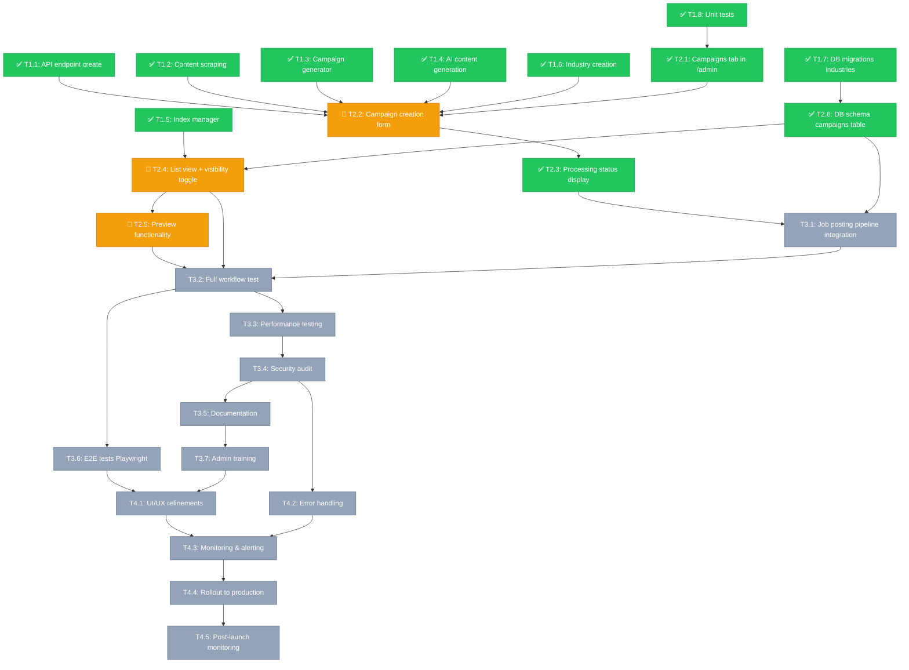

# Campaign Creation DAG (Phase 2.A - Simplified Admin UI)

**Status**: Phase 2.A In Progress (4/6 tasks ~67%)  
**Last updated**: 2025-10-01 10:35  
**Related**: [Campaign Creation Architecture](./CAMPAIGN_CREATION_ARCHITECTURE.md)

This document provides a task dependency graph (DAG) for Campaign Creation implementation following the Phase 2.A pivot (no online editor).

**Current State (Validated):**
- ✅ Phase 1: Backend - COMPLETE (8/8 tasks)
- 🔄 Phase 2.A: Admin UI - IN PROGRESS (5/6 tasks, ~83%)
  - ✅ T2.1: Campaigns tab - COMPLETE
  - 🔄 T2.2: Creation form - PARTIAL (needs LLM industry classification)
  - ✅ T2.3: Processing status - COMPLETE
  - 🔄 T2.4: List view - EXISTS (needs refactor: remove Edit/Bulk Delete)
  - 🔄 T2.5: Preview - EXISTS (needs extraction from Edit modal)
  - ✅ T2.6: DB schema - COMPLETE (migration + API ready, needs deployment)

## Diagram (Mermaid)



## Critical Path

**Phase 1 → Phase 2.A → Phase 3 → Phase 4**

### Critical Dependencies:

1. **Backend Foundation (Complete ✅)**
   - T1.1 (API endpoint) → T2.2 (Form integration)
   - T1.2 (Scraping) → T2.2 (Form URL input)
   - T1.3 (Generator) → T2.2 (MDX creation)
   - T1.7 (DB migrations) → T2.6 (campaigns table)

2. **Admin UI Core (Phase 2.A)**
   - T2.1 (Tab) → T2.2 (Form) → T2.3 (Status) → T2.4 (List)
   - T2.6 (DB schema) must complete before T2.4 (List with visibility)
   - T2.5 (Preview) depends on T2.4 (List view)

3. **Integration Path**
   - T2.3 (Status) → T3.1 (Pipeline integration)
   - T2.6 (campaigns table) → T3.1 (Job posting link)
   - T3.1 (Integration) → T3.2 (Full workflow test)

4. **Quality Gates**
   - T3.4 (Security) → T4.2 (Error handling)
   - T3.6 (E2E tests) → T4.1 (UI refinements)
   - T4.3 (Monitoring) → T4.4 (Rollout)

## Parallelization Opportunities

### Phase 2.A (Week 2):
- **Parallel Group 1** (After T2.1):
  - T2.2: Campaign creation form
  - T2.6: Database schema (independent)

- **Parallel Group 2** (After T2.2):
  - T2.3: Processing status
  - T2.4: List view (if T2.6 complete)

### Phase 3 (Week 3):
- **Parallel Group 1** (After T3.1):
  - T3.2: Full workflow testing
  - T3.3: Performance testing
  - T3.4: Security audit (can start early)

- **Parallel Group 2** (After T3.2):
  - T3.5: Documentation
  - T3.6: E2E tests
  - T3.7: Admin training materials

### Phase 4 (Week 4):
- **Parallel Group 1** (After T3.7):
  - T4.1: UI/UX refinements
  - T4.2: Error handling improvements

- **Sequential** (Quality gates):
  - T4.1/T4.2 → T4.3 → T4.4 → T4.5

## Phase 2.A Specific Notes

### Current State (Validated 2025-10-01):

**✅ Complete (3/6):**
- T2.1: Campaigns tab exists in AdminTabs
- T2.3: ProcessingStatus component working
- T2.6: Database schema - Migration created, API endpoints updated

**🔄 Partial (3/6):**
- T2.2: Form exists (needs LLM industry classification)
- T2.4: List view exists (needs refactor: remove Edit/Bulk Delete, add Visibility toggle)
- T2.5: Preview exists in Edit modal (needs extraction to standalone modal)

**📝 Deployment Required:**
- T2.6: Run `supabase db push` to apply migration
- T2.6: Run `npx tsx scripts/backfill-campaigns.ts` to populate data

### Removed Dependencies (vs Original Phase 2):
- ❌ No editor state management
- ❌ No content versioning system
- ❌ No PUT /api/admin/campaigns/:slug (edit endpoint)
- ❌ No DELETE endpoint
- ❌ No bulk actions

### New Dependencies (Phase 2.A):
- ✅ T2.6: `campaigns` table in Supabase (metadata storage) - **UNBLOCKED**
- 🔄 T2.4: Visibility toggle integration with DB (ready - T2.6 complete)
- ✅ Local filesystem: MDX files remain source of truth

### Data Flow Dependencies:

```
Campaign Creation:
T1.1 (API) → T1.2 (Scraping) → T1.4 (AI) → T1.3 (Generator) → MDX file
                                              ↓
                                         T2.6 (campaigns table)
                                              ↓
                                         T2.4 (List view)

Campaign Visibility:
T2.6 (campaigns table) → T2.4 (Toggle UI) → Cache invalidation
```

## Blocking Issues & Risks

### Phase 2.A:
- **T2.6 blocker**: RLS policies must work correctly (admin-only write)
- **T2.4 blocker**: campaigns table must exist before list view
- **T2.2 risk**: Form validation complexity (3 input methods)

### Phase 3:
- **T3.1 risk**: Job posting pipeline integration may reveal inconsistencies
- **T3.4 critical**: Security audit must pass before T4.4 (rollout)
- **T3.6 blocker**: E2E tests must be stable (no flakes)

### Phase 4:
- **T4.3 critical**: Monitoring must be active before T4.4 (rollout)
- **T4.4 risk**: Zero-downtime deployment requires careful planning

## Recommended Execution Order

### Week 2 (Phase 2.A):
```
Day 1-2: T2.1 (Tab) + T2.6 (DB schema in parallel)
Day 3-4: T2.2 (Form) + T2.4 (List view after T2.6)
Day 5:   T2.3 (Status) + T2.5 (Preview)
```

### Week 3 (Phase 3):
```
Day 1-2: T3.1 (Integration)
Day 3:   T3.2 (Workflow test) + T3.3 (Performance) in parallel
Day 4:   T3.4 (Security audit)
Day 5:   T3.5 (Docs) + T3.6 (E2E) + T3.7 (Training) in parallel
```

### Week 4 (Phase 4):
```
Day 1-2: T4.1 (UI/UX) + T4.2 (Error handling) in parallel
Day 3:   T4.3 (Monitoring setup)
Day 4:   T4.4 (Rollout to prod)
Day 5:   T4.5 (Post-launch monitoring)
```

## Success Metrics by Phase

### Phase 2.A Complete:
- ✅ Admin can create campaigns via form
- ✅ MDX files generated correctly
- ✅ campaigns table stores metadata
- ✅ Visibility toggle works
- ✅ Preview functionality works

### Phase 3 Complete:
- ✅ Job posting pipeline integrated
- ✅ E2E tests pass (100%)
- ✅ Security audit passed (0 critical issues)
- ✅ Performance benchmarks met (<30s workflow)
- ✅ Admin training complete

### Phase 4 Complete:
- ✅ Production deployment successful
- ✅ Monitoring active
- ✅ Zero downtime
- ✅ Post-launch metrics healthy

## Integration Points

### External Dependencies:
- **Supabase**: campaigns table, RLS policies, migrations
- **Job Posting Pipeline**: Workflow 1 (file watcher)
- **RAG System**: Embeddings storage (chunks table)
- **Admin Auth**: Google login, ADMIN_EMAILS check
- **Cache System**: Revalidation on visibility toggle

### API Dependencies:
- POST /api/admin/campaigns/create (T1.1)
- PUT /api/admin/campaigns/:slug/visibility (T2.6)
- GET /api/admin/campaigns (T2.4)
- POST /api/admin/campaigns/:slug/preview (T2.5)

## Notes

- **Phase 2.A pivot**: No online editor reduces complexity significantly
- **MDX files**: Single source of truth for content (edited locally)
- **Supabase campaigns table**: Metadata + visibility status only
- **Testing priority**: Security audit (T3.4) before production rollout
- **Training emphasis**: Local editing workflow (T3.7)

## Related Documents

- [Campaign Creation Architecture](./CAMPAIGN_CREATION_ARCHITECTURE.md) - Full specification
- [Job Posting Intelligence Spec](./JOB_POSTING_INTELLIGENCE_SPEC.md) - Workflow 1 & 3
- [Living Layouts Implementation](./LIVING_LAYOUTS_IMPLEMENTATION.md) - Component library
- [AUI DAG](./AUI_DAG.md) - System-wide task dependencies

---

## Legend

- 🟢 **Complete** (green): Task fully implemented and working
- 🟠 **Partial** (orange): Task partially implemented, needs completion/refactor
- 🔴 **Blocked** (red): Task not started, blocking other tasks
- ⚪ **Pending** (gray): Task not started, waiting for dependencies

---

**Version**: 1.1 (Phase 2.A - Current State Validated)  
**Author**: Cascade AI  
**Status**: Phase 1 Complete ✅ | Phase 2.A In Progress 🔄 (4/6 tasks ~67%)

**Next Action**: Task 2.6 - Database Schema (CRITICAL blocker)
