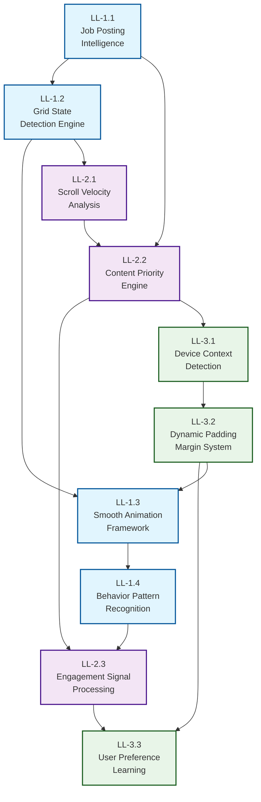

# Living Layouts Implementation: DAG & Execution Order

## 🌀 Living Layouts Dependency Graph



## 📋 Recommended Execution Order

### **Phase 1: Foundation (Weeks 1-4)**
**Parallel Development - Can be done simultaneously:**

1. **LL-1.1 Job Posting Intelligence** → LL-1.2 → LL-1.3 → LL-1.4
   - Core behavior analysis system
   - Foundation for all adaptive features

2. **LL-2.1 Scroll Velocity Analysis** → LL-2.2 → LL-2.3
   - Content rearrangement capabilities
   - Engagement signal processing

3. **LL-3.1 Device Context Detection** → LL-3.2 → LL-3.3
   - Context-aware spacing system
   - User preference learning

### **Phase 2: Integration (Weeks 5-8)**
**Sequential Dependencies - Must be done in order:**

1. **Complete Phase 1** (all workstreams)
2. **Cross-workstream Integration:**
   - LL-1.1 → LL-2.1 (behavior patterns → content rearrangement)
   - LL-2.2 → LL-3.1 (content priority → spacing decisions)
   - LL-3.2 → LL-1.2 (spacing → grid animations)

### **Phase 3: Testing & Optimization (Weeks 9-12)**
**Validation & Performance Tuning:**

1. **A/B Testing Framework** (LL-2.2 integration point)
2. **Performance Optimization** (all workstreams)
3. **Cross-browser Validation** (all workstreams)
4. **Accessibility Compliance** (all workstreams)

---

## 🎯 Critical Path Analysis

### **Longest Path (12 weeks):**
```
LL-1.1 → LL-1.2 → LL-1.3 → LL-1.4 → LL-2.1 → LL-2.2 → LL-2.3 → LL-3.1 → LL-3.2 → LL-3.3
     ↓       ↓       ↓       ↓       ↓       ↓       ↓       ↓       ↓
  Phase 1   Int     Int    Phase 2   Int    Phase 3   Int    Final   Final
```

### **Parallel Opportunities:**
- **LL-1.x**, **LL-2.x**, **LL-3.x** can develop in parallel
- **Cross-integration** happens after individual completion
- **Testing** can begin as soon as first workstream completes

---

## ⚡ Acceleration Strategies

### **Risk Mitigation:**
- **Feature Flags**: Each workstream behind flags for safe deployment
- **Progressive Enhancement**: Graceful degradation if animations fail
- **Fallback Systems**: Static layouts available if dynamic systems fail

### **Resource Optimization:**
- **Shared Infrastructure**: Telemetry system used by all workstreams
- **Reusable Components**: Animation framework shared across features
- **Common Testing**: Cross-workstream integration tests

---

## 🔍 Dependency Rationale

| Dependency | Reason | Risk if Violated |
|------------|--------|------------------|
| LL-1.1 → LL-2.1 | Behavior patterns needed for content decisions | Random rearrangements |
| LL-2.2 → LL-3.1 | Content priority affects spacing choices | Inconsistent UX |
| LL-3.2 → LL-1.2 | Spacing calculations impact animation performance | Layout thrashing |

---

## 📊 Success Gates by Phase

### **Phase 1 Gates:**
- ✅ All individual workstreams functional independently
- ✅ Performance benchmarks met (60fps animations)
- ✅ Core Web Vitals maintained during development

### **Phase 2 Gates:**
- ✅ Cross-workstream integration stable
- ✅ No performance regressions from dependencies
- ✅ Feature flags operational for all components

### **Phase 3 Gates:**
- ✅ A/B testing framework validates improvements
- ✅ Accessibility compliance verified
- ✅ Production monitoring systems in place

---

*This DAG ensures Living Layouts are built systematically, with proper dependencies respected and parallel development maximized for fastest time-to-market.*